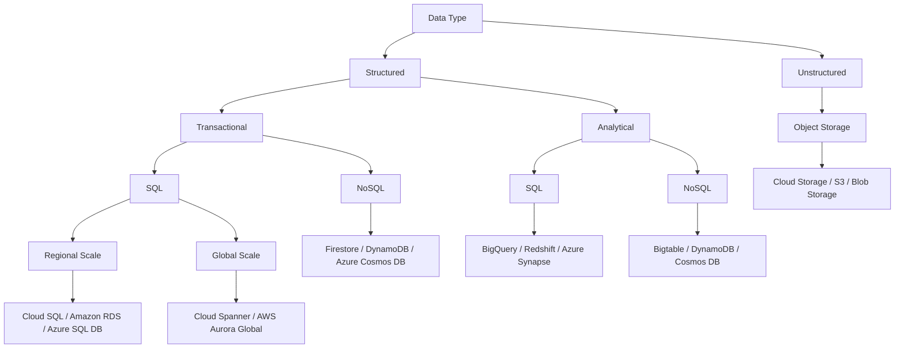
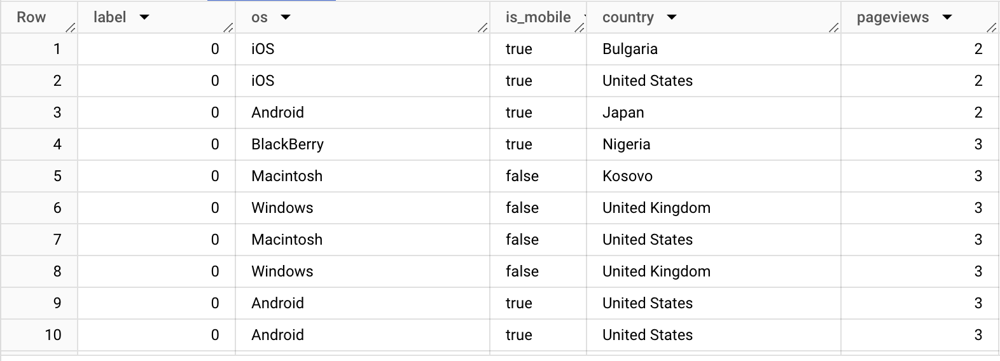
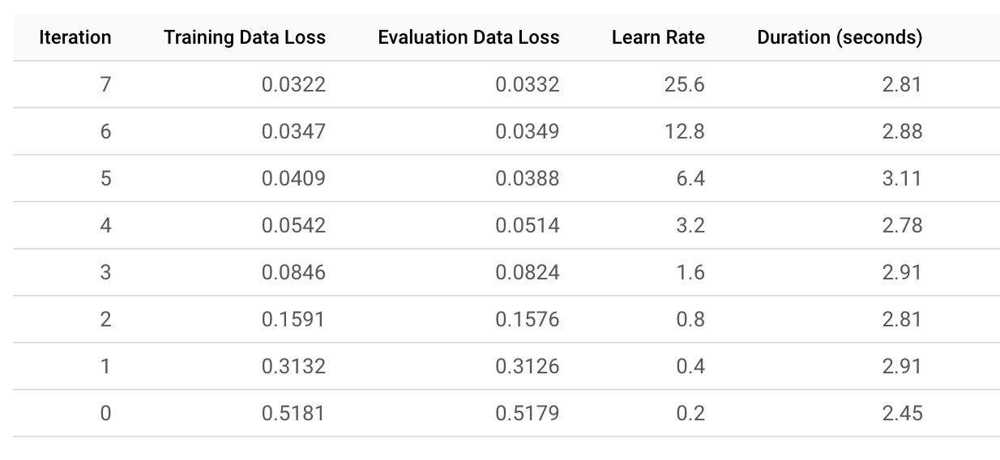
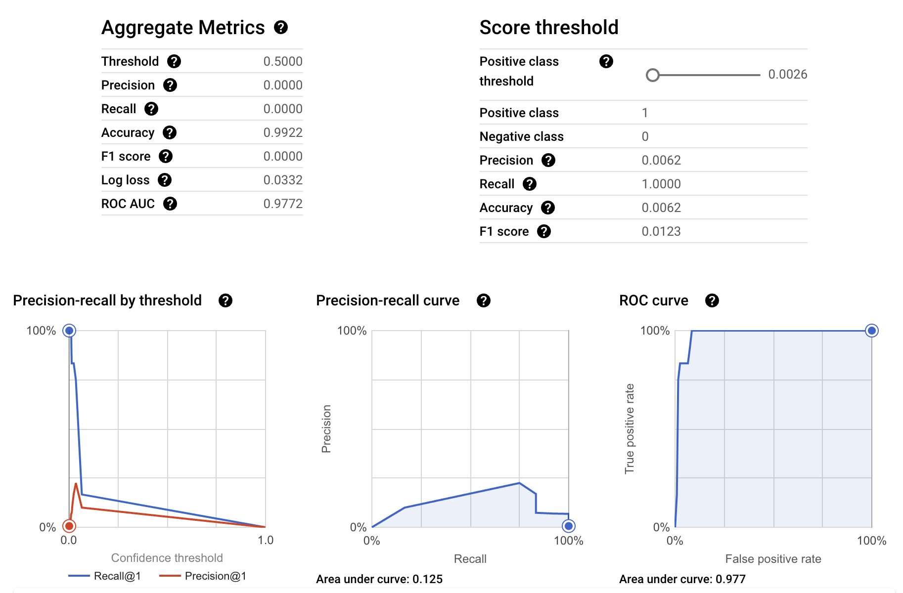
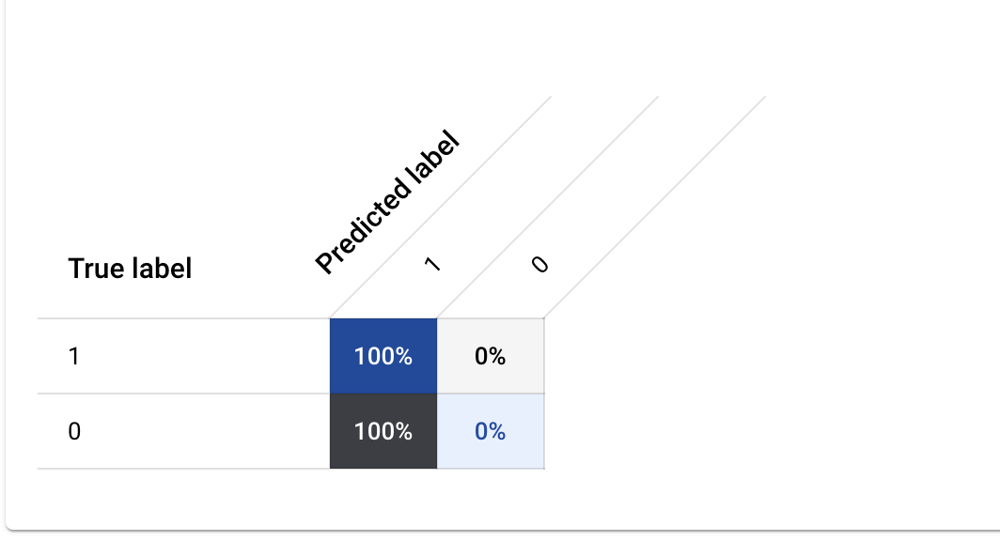

# AI and Machine Learning in the Cloud: A Beginner's Guide

Artificial Intelligence (AI) and Machine Learning (ML) are changing the world, making it easier for computers to do things that only humans could do before. With new AI tools that can create content based on simple instructions, there are now more ways than ever to use this technology in everyday work and life.

For example, if you’re a developer, you might want to add AI features to your app to make it more useful. If you work with data, you could build an ML model to help solve problems at your job. Even if you’re just curious about AI, learning about it can spark fresh ideas for new projects or businesses.

This hand book is here to help you understand how AI works and show you how to start using it. You’ll learn about basic tools that can help you get from raw data to useful AI solutions. We’ll also explore how you can use generative AI tools to develop your own projects.

### What is this book about?

This book is a practical toolbox, filled with essential AI technologies and tools that you can use to build new projects or enhance your existing ones. We’ve organized these tools in layers, so you’ll start with the basics, like data storage and analytics, and work up to advanced topics like building custom ML models. Along the way, you’ll explore generative AI solutions that can generate content, solve problems.

### Objectives

By the end of this book, you will be able to:

- **Understand** the basics of AI and how it can be applied to real-world projects.
- **Recognize** the essential tools needed to turn data into AI-driven solutions.
- **Identify** different options for incorporating AI into various types of projects.
- **Start experimenting** with AI, giving you the confidence to innovate and explore new possibilities.

## Why AI and How It Can Help Businesses?

These might be your first questions. Let's explore an example to understand how AI can make business operations more efficient.

**City Wheels**, a local company that provides bike rentals in cities like Amsterdam, Chicago, and Sydney, is a good example.

City Wheels faced three main challenges:

1. **Choosing Locations and Optimizing Routes**: Predicting the best spots for bike rental stations and optimizing bike routes based on weather and traffic.
2. **Demand Prediction and Real-Time Tracking**: Predicting rental demand and tracking performance in real-time to ensure enough bikes are available.
3. **Automating Customer Alerts**: Automating notifications to customers about station availability or weather conditions to help them plan their ride.

Recognizing the potential of AI, City Wheels sought help from **Bright Analytics**, a data consultancy, to use data and AI to solve these challenges.

### A Simple Dashboard for City Wheels

The team created a simple dashboard to show the performance across the cities they operate in, providing insights into metrics like **revenue**, **bike availability**, and **rental duration**. They used common tools like **spreadsheets** for data logging and scripts for analyzing data.

For example, the dashboard shows statistics about Amsterdam, such as rental frequency, average revenue per bike, and station performance. In the top left corner, you can see the **weather conditions**, which helps the system suggest route changes based on forecasts. For example, if rain is expected, it might suggest safer, covered routes.

### AI-Powered Predictions and Alerts

City Wheels used prediction tools to forecast peak rental times. If a major city event like a festival was happening, the system would automatically adjust bike availability to meet increased demand.

The AI also helps with **customer alerts**. For example, if a station is running low on bikes, a script automatically sends messages to customers about nearby available locations. This feature makes sure customers always have up-to-date information, improving their experience.

### Streamlined Business with AI

Adding these basic AI features helped City Wheels achieve the following benefits:

- **Better Operations**: Improved the efficiency of bike distribution across stations and ensured enough bikes were available using real-time data.
- **Improved Customer Experience**: Automated notifications and route suggestions helped customers have a more informed and convenient rental experience.
- **Easier Scaling**: With automated dashboards and scripts, City Wheels could expand operations without adding much administrative work.

Behind the scenes, the approach was simple:

1. **Data Collection**: Collecting data on bike rentals, station performance, and customer preferences using simple spreadsheets.
2. **Prediction and Automation**: Using scripts for demand prediction and customer alerts.
3. **Visualization**: Showing the insights through an easy-to-use dashboard.

By using these tools, City Wheels made their operations more efficient, improved customer service, and increased productivity—showing how even basic AI and data-driven methods can lead to big improvements in business performance.

## What is Responsible AI?

Responsible AI refers to the development, deployment, and use of artificial intelligence systems in ways that prioritize ethical considerations, fairness, transparency, accountability, and the well-being of all stakeholders. The goal is to ensure that AI technologies align with societal values and do not perpetuate harm or bias. Key principles in responsible AI include:

1. **Fairness:** Ensuring that AI systems do not discriminate against individuals or groups, intentionally or unintentionally. This involves addressing biases in data and algorithms.

2. **Transparency:** Making AI systems understandable and explainable to users, so people can see how decisions are made and feel confident in the technology.

3. **Accountability:** Ensuring that creators and users of AI systems take responsibility for their impact and have mechanisms in place for recourse if something goes wrong.

4. **Privacy:** Protecting user data by implementing strong security measures and respecting data privacy laws and regulations.

5. **Safety:** Prioritizing the safety and security of AI systems to prevent harm, including developing safeguards against misuse or malicious actions.

6. **Inclusivity:** Involving diverse perspectives in the design and development process to minimize blind spots and create systems that work well for everyone.

7. **Sustainability:** Considering the environmental impact of AI systems and finding ways to reduce their energy consumption and carbon footprint.

## Cloud Infrastructure

When exploring the infrastructure and services offered by various cloud providers, such as Amazon Web Services (AWS), Microsoft Azure, and Google Cloud Platform (GCP), it's essential to understand the core components: processing power, storage options, and how to determine the best fit for different data types. Following highlights key features across these providers to help you make informed decisions.

### Processing Power

Cloud computing platforms provide various types of processing power to meet diverse computational needs, especially for data-intensive and machine learning tasks. Let's compare the options available:

- **CPU (Central Processing Unit):** CPUs are general-purpose processors suitable for a wide range of applications. All major cloud providers offer CPU options that can be configured based on needs. For instance, AWS provides EC2 instances with Intel or AMD CPUs, and Azure offers similar virtual machines. Google’s Compute Engine also offers customizable CPU instances, allowing users to select specific virtual CPU and memory configurations.

- **GPU (Graphics Processing Unit):** GPUs are optimized for parallel processing tasks, making them ideal for high-performance computing (HPC) and machine learning workloads. AWS offers GPU-based instances through its EC2 P-series and G-series, supporting frameworks like TensorFlow and PyTorch. Azure has its own GPU VMs under the NC-series and NV-series, while Google Cloud offers GPU instances with options for both NVIDIA Tesla and AMD cards.

- **TPU (Tensor Processing Unit):** Designed specifically for machine learning, TPUs are unique to Google Cloud. They provide accelerated computing power for AI tasks, especially for frameworks like TensorFlow. Google developed TPUs to handle matrix multiplication and other computations common in neural network training. AWS and Azure do not offer TPUs but have enhanced GPU support for similar AI workloads. For companies heavily investing in AI, Google’s TPU offerings might provide a competitive edge in processing speed and efficiency.

### Storage Options

Cloud storage solutions fall into different categories based on the type of data and access needs. Object storage, SQL databases, and NoSQL databases each serve different purposes:

#### Object Storage

Object storage is suitable for unstructured data like images, videos, and backups.

- **AWS S3 (Simple Storage Service):** Provides scalable object storage with multiple storage classes like Standard, Intelligent-Tiering, Infrequent Access, and Glacier for long-term archiving.
- **Google Cloud Storage:** Google offers four storage classes—Standard, Nearline, Coldline, and Archive—catering to different access needs and cost considerations.

- **Azure Blob Storage:** Azure's object storage solution includes tiers like Hot, Cool, and Archive, which mirror the options provided by AWS and GCP for access frequency and cost optimization.

#### SQL Databases

For structured, transactional data that requires SQL access, cloud providers offer managed relational database services.

- **Amazon RDS (Relational Database Service):** RDS supports MySQL, PostgreSQL, Oracle, and Microsoft SQL Server. It’s ideal for applications requiring regional scalability and consistent access.

- **Google Cloud SQL:** Google’s managed SQL database service supports MySQL, PostgreSQL, and SQL Server, ideal for regional data storage needs.

- **Azure SQL Database:** Azure’s fully managed relational database service supports SQL Server and is highly integrated with Azure services, providing options for scaling globally or regionally.

#### NoSQL Databases

For structured data that doesn’t fit neatly into a relational model, NoSQL databases are available:

- **AWS DynamoDB:** A fully managed NoSQL database that offers fast, consistent performance for applications requiring high read and write throughput. DynamoDB is suited for transactional workloads with global scalability.

- **Google Firestore:** A NoSQL, document-oriented database supporting real-time data synchronization, ideal for mobile and web applications requiring transactional support.

- **Azure Cosmos DB:** A globally distributed NoSQL database supporting multiple models, including key-value, graph, and document data. Cosmos DB offers low-latency and high scalability across multiple Azure regions.

### Analytical Storage Options

For analytical workloads, cloud providers offer data warehouses and big data solutions.

- **AWS Redshift:** A data warehouse solution designed for big data and analytical tasks. Redshift supports large-scale queries with fast performance.

- **Google BigQuery:** Google’s fully managed data warehouse optimized for analytics. BigQuery is particularly suited for massive data processing needs with SQL-based querying capabilities.

- **Azure Synapse Analytics:** An analytics service that brings together big data and data warehousing. Synapse Analytics enables high-performance SQL and Apache Spark data processing.

### Choosing the Right Storage Solution

When selecting a storage solution, consider the data type and business requirements.

- **For transactional, SQL-based data** that requires frequent updates and local scalability, **Cloud SQL (Google)**, **Amazon RDS (AWS)**, or **Azure SQL Database** are ideal choices. For global scalability, **Google Cloud Spanner** or **AWS Aurora Global Database** offer more comprehensive solutions.

- **For transactional, NoSQL data**, **Firestore (Google)** or **DynamoDB (AWS)** provides scalability for web and mobile applications.

- **For analytical workloads** requiring SQL, **BigQuery (Google)**, **Redshift (AWS)**, or **Azure Synapse Analytics** are designed to handle complex queries on large datasets.

- **For unstructured data** such as media files or backups, **Google Cloud Storage**, **AWS S3**, and **Azure Blob Storage** provide scalable, secure storage with varying classes or tiers suited to different access patterns.



## Data and AI Solutions

The journey from data to AI can generally be divided into four categories: **ingestion and processing**, **data storage**, **analytics**, and **AI/machine learning**.

**1. Data Ingestion and Processing**

Data ingestion and processing involve gathering data from multiple sources and transforming it into a format suitable for storage and analysis. This stage includes both real-time and batch data processing.

Cloud platforms provide various tools to collect and process data in both real-time and batch formats. For example:

- **Google Cloud**: Offers services like **Pub/Sub** for real-time messaging, **Dataflow** for stream and batch processing, **Dataproc** for running Apache Spark and Hadoop, and **Cloud Data Fusion** for data integration.
- **AWS**: Features services like **Kinesis** for real-time data ingestion, **Glue** for ETL (extract, transform, load) tasks, and **EMR** for running big data frameworks like Hadoop and Spark.
- **Microsoft Azure**: Has **Azure Event Hubs** for real-time data streaming, **Azure Data Factory** for ETL and integration services, and **HDInsight** for managed Hadoop and Spark clusters.

**2. Data Storage**

Data storage is the process of saving the collected data in suitable storage solutions. Depending on the type of data (structured, unstructured, or semi-structured) and business needs, different storage options are used to ensure scalability, reliability, and ease of access.

Once data is collected, it needs to be stored in appropriate databases or storage services. Different types of data require different storage solutions:

- **Google Cloud**: Offers **Cloud Storage** for unstructured data, **BigQuery** for data warehousing, **Cloud SQL** and **Spanner** for relational data, and **Firestore** and **Bigtable** for NoSQL databases.
- **AWS**: Provides **S3** for object storage, **RDS** and **Aurora** for SQL databases, **Redshift** for data warehousing, and **DynamoDB** for NoSQL needs.
- **Microsoft Azure**: Offers **Azure Blob Storage** for unstructured data, **Azure SQL Database** and **Cosmos DB** for SQL and NoSQL data, and **Azure Synapse** for big data analytics.

**3. Data Analytics**

Data analytics involves analyzing the stored data to derive meaningful insights. This stage includes using tools to query, visualize, and model the data, ultimately enabling businesses to make informed decisions based on the insights gained.

After storing the data, analytics tools come into play to derive meaningful insights:

- **Google Cloud**: **BigQuery** is a popular fully managed data warehouse that enables SQL-based analytics and integration with AI features. **Looker** provides powerful BI tools for data visualization and modeling.
- **AWS**: **Redshift** is a powerful data warehouse solution that integrates seamlessly with AWS services. **QuickSight** is AWS's BI tool for visualizing and analyzing data.
- **Microsoft Azure**: **Azure Synapse Analytics** combines big data and data warehousing to offer SQL-based analytics, and **Power BI** provides a user-friendly way to visualize and report on the data.

**4. AI and Machine Learning**

AI and machine learning involve using the analyzed data to build predictive models or generate new content. This stage includes training, deploying, and managing AI models that can help predict future trends or solve complex problems.

The final stage is using data to build AI models that can generate predictions or create content:

- **Google Cloud**: **Vertex AI** provides an integrated environment for building and deploying machine learning models, with tools like AutoML, Workbench, and Model Garden.
- **AWS**: **SageMaker** is AWS's machine learning platform that offers end-to-end services, from data labeling to model deployment and monitoring.
- **Microsoft Azure**: **Azure Machine Learning** provides tools for model training, deployment, and management, along with features for automated machine learning (AutoML).

## Understanding AI and ML

The terms "artificial intelligence" and "machine learning" are often used interchangeably, but they are not the same. AI is a broad concept that encompasses any technology that enables machines to mimic human intelligence—whether it is in problem-solving, recognizing speech, or making decisions. Imagine a robot that can navigate a maze without any explicit programming or a virtual assistant capable of holding a conversation. These are examples of AI.

Machine learning, on the other hand, is a subset of AI focused on providing machines the ability to learn from data without needing explicit instructions. In contrast to traditional programming—where every step of what the computer should do is hard-coded—ML enables machines to learn patterns from examples. Think of teaching a computer to identify different tree species by showing it many images of various trees. This is machine learning at work.

ML itself can be divided into various categories, most notably supervised learning, unsupervised learning, and deep learning. Each type comes with distinct techniques and use cases.

## Categories of Machine Learning

### Supervised Learning

Supervised learning involves training a model using data that has labels. A label is simply the answer we want the model to learn—much like having a teacher explain each problem to a student with the correct answer. Consider a scenario where you want to teach a machine to recognize the difference between different genres of music. You could provide the computer with thousands of music clips, each labeled with its genre—such as "jazz," "rock," or "classical." By learning from these labeled examples, the machine learns how to identify new music clips that it hasn’t encountered before. This process is called supervised learning because the model is being "supervised" by being provided the correct answers during training.

Supervised learning can be further divided into two categories:

1. **Classification**: When the goal is to predict a category or class, such as determining whether an email is "spam" or "not spam," or predicting the type of flower based on petal length and width, it is called a classification problem.
   - **Model Example**: **Logistic Regression** is a popular model used for classification tasks., such as determining whether an email is "spam" or "not spam," or predicting the type of flower based on petal length and width, it is called a classification problem.
2. **Regression**: When the task involves predicting a continuous value, such as estimating the price of a house based on its features (size, location, number of bedrooms, etc.), it is called a regression problem.
   - **Model Example**: **Linear Regression** is a commonly used model for regression tasks., such as estimating the price of a house based on its features (size, location, number of bedrooms, etc.), it is called a regression problem.

### Unsupervised Learning

Unsupervised learning is different from supervised learning because the data provided to the model is unlabeled. There are no "correct answers" to guide the learning process. Instead, the machine finds hidden patterns or relationships on its own. Imagine that you run an art gallery and you have paintings of different styles, but you don’t know which categories they belong to. By applying unsupervised learning, you could group similar paintings together based on their visual characteristics—such as color schemes, brushstrokes, or subject matter—without explicitly telling the model what to look for. This is clustering, a common form of unsupervised learning.

Unsupervised learning can be grouped into the following categories:

1. **Clustering**: This method is used to identify similarities among data points and group them accordingly. For instance, online retailers may use clustering to understand customer segments and offer personalized promotions.
   - **Model Example**: **K-means** is a popular model for clustering tasks. and group them accordingly. For instance, online retailers may use clustering to understand customer segments and offer personalized promotions.
2. **Association**: This technique is used to find relationships between variables in a dataset. For example, a grocery store might use association to determine which products are often purchased together—such as bread and butter—to create more effective marketing campaigns.
   - **Model Example**: The **Apriori Algorithm** is frequently used for association tasks. in a dataset. For example, a grocery store might use association to determine which products are often purchased together—such as bread and butter—to create more effective marketing campaigns.
3. **Dimensionality Reduction**: Sometimes data can have an overwhelming number of features, making it difficult to analyze efficiently. Dimensionality reduction is used to reduce the number of features while retaining the important information. For example, a health survey with many questions might be simplified to just a few key factors representing a person’s lifestyle.
   - **Model Example**: **Principal Component Analysis (PCA)** is commonly used for dimensionality reduction., making it difficult to analyze efficiently. Dimensionality reduction is used to reduce the number of features while retaining the important information. For example, a health survey with many questions might be simplified to just a few key factors representing a person’s lifestyle.

## Deep Learning and Generative AI

Deep learning is a specialized subset of machine learning that uses multi-layered artificial neural networks to perform complex tasks. Imagine trying to teach a computer to recognize faces. This requires identifying features at multiple levels—such as detecting edges, shapes, and then combining them into recognizable facial features. Deep neural networks accomplish this by adding many layers between the input data (such as an image) and the output (such as identifying the face). These layers progressively refine the learning, allowing the machine to understand complex features.

Generative AI is a special form of deep learning that allows models to generate new content, such as text, images, or music. Suppose you want a computer to write poetry. You could use a generative AI model, trained on thousands of poems, to produce original verses.

- **Model Example**: **GPT (Generative Pre-trained Transformer)** is a well-known model for generative AI.

Generative AI relies on very large models called large language models (LLM), which have learned from massive datasets to produce coherent and contextually appropriate outputs. that allows models to generate new content, such as text, images, or music. Suppose you want a computer to write poetry. You could use a generative AI model, trained on thousands of poems, to produce original verses. Generative AI relies on very large models called large language models, which have learned from massive datasets to produce coherent and contextually appropriate outputs.

## Comparing Supervised and Unsupervised Learning

To clarify the distinction between supervised and unsupervised learning, consider the following examples:

- **Supervised Learning**: You have a set of animal sounds, each labeled as "dog," "cat," or "bird." You use these labeled sounds to train a model that can predict the animal from an unknown sound. Here, the model is guided by the labels provided, and the objective is to make accurate predictions.
- **Unsupervised Learning**: Imagine you are given recordings of various animal sounds, but there are no labels indicating which animal made which sound. An unsupervised learning model could identify which sounds are similar and group them accordingly, allowing you to understand which sounds might belong to the same or related species.

## Test Your Knowledge

1. You are working at a bank and want to predict whether a customer will default on their loan based on their financial history and credit score.

   - What category of learning is this?
     <details>
       <summary>Answer</summary>
       Supervised Learning
     </details>
   - What type of model should you use?
     <details>
       <summary>Answer</summary>
       Classification, such as **Logistic Regression**
     </details>

2. Imagine you own a retail store and want to group customers based on their purchasing behavior to understand different customer segments.

   - What category of learning is this?
     <details>
       <summary>Answer</summary>
       Unsupervised Learning
     </details>
   - What type of model should you use?
     <details>
       <summary>Answer</summary>
       Clustering, such as **K-means**
     </details>

3. You are an engineer at an energy company and need to forecast energy consumption for the upcoming month based on historical data.

   - What category of learning is this?
     <details>
       <summary>Answer</summary>
       Supervised Learning
     </details>
   - What type of model should you use?
     <details>
       <summary>Answer</summary>
       Regression, such as **Linear Regression**
     </details>

4. You work for a supermarket and want to discover which products are frequently bought together to optimize product placement.

   - What category of learning is this?
     <details>
       <summary>Answer</summary>
       Unsupervised Learning
     </details>
   - What type of model should you use?
     <details>
       <summary>Answer</summary>
       Association, such as **Apriori Algorithm**
     </details>

5. You have a dataset of images, and you want to reduce the number of features to make it easier to process while retaining the most important information.
   - What category of learning is this?
     <details>
       <summary>Answer</summary>
       Unsupervised Learning
     </details>
   - What type of model should you use?
     <details>
       <summary>Answer</summary>
       Dimensionality Reduction, such as **Principal Component Analysis (PCA)**
     </details>

## Training a Logistic Regression Model on Google Merchandise Shop Data using BigQuery ML

In this section, we build and evaluate a logistic regression model using Google Merchandise Shop data. We'll explore how to prepare the data, train the model, evaluate its performance, and make predictions. Along the way, we'll delve into key concepts and terms that are essential for understanding machine learning models in a BigQuery ML environment.

### 1. Introduction to the Dataset

The Google Merchandise Shop dataset is a publicly available dataset that contains Google Analytics sample data. It includes information about user interactions with the online store, such as page views, transactions, device information, and geographic data.

Our goal is to predict whether a user session will lead to a transaction (purchase) based on features like operating system, device type, country, and page views.

### 2. Data Preparation

Before training the model, we need to prepare the data by selecting relevant features and formatting it appropriately.

#### 2.1 Extracting Relevant Features

We use the following SQL query to extract the necessary features from the dataset:

```sql
SELECT
  IF(totals.transactions IS NULL, 0, 1) AS label,
  IFNULL(device.operatingSystem, "") AS os,
  device.isMobile AS is_mobile,
  IFNULL(geoNetwork.country, "") AS country,
  IFNULL(totals.pageviews, 0) AS pageviews
FROM
  `bigquery-public-data.google_analytics_sample.ga_sessions_*`
WHERE
  _TABLE_SUFFIX BETWEEN '20160801' AND '20170631'
LIMIT 10000;
```

**Explanation of the Query:**

- **IF(totals.transactions IS NULL, 0, 1) AS label**: Creates a binary label where sessions with transactions are marked as `1` (positive class) and those without are `0` (negative class).
- **IFNULL(device.operatingSystem, "") AS os**: Retrieves the operating system used during the session, replacing `NULL` values with an empty string.
- **device.isMobile AS is_mobile**: A boolean indicating if the device used is mobile.
- **IFNULL(geoNetwork.country, "") AS country**: Retrieves the country from which the session originated, replacing `NULL` values with an empty string.
- **IFNULL(totals.pageviews, 0) AS pageviews**: Number of pages viewed during the session, with `NULL` values replaced by `0`.

We save the result of this query as `training_data`.



### 3. Training the Logistic Regression Model

With our data prepared, we proceed to train a logistic regression model using BigQuery ML.

#### 3.1 Creating the Model

We use the following SQL command to create and train the model:

```sql
CREATE OR REPLACE MODEL `bqml.sample_model`
OPTIONS(model_type='logistic_reg') AS
SELECT * FROM `bqml.training_data`;
```

**Explanation of the Command:**

- **CREATE OR REPLACE MODEL `bqml.sample_model`**: Creates a new model or replaces an existing one named `sample_model` in the `bqml` dataset.
- **OPTIONS(model_type='logistic_reg')**: Specifies that the model type is logistic regression.
- **AS SELECT \* FROM `bqml.training_data`**: Uses all columns from `training_data` as input features for training.

#### 3.2 Understanding the Training Output

After running the command, BigQuery ML provides a training output that includes several key metrics:



**Key Terms Explained:**

- **Iteration**: Represents each pass through the training data during the optimization process.
- **Training Data Loss**: Measures how well the model fits the training data; lower values indicate a better fit.
- **Evaluation Data Loss**: Measures the model's performance on a separate evaluation dataset.
- **Learn Rate**: The step size used in the optimization algorithm to update the model parameters.
- **Duration (seconds)**: Time taken for each iteration.

### 4. Evaluating the Model

Evaluation is crucial to understand how well our model generalizes to unseen data.

#### 4.1 Evaluating Model Performance

We use the following SQL command to evaluate the model:

```sql
SELECT
  *
FROM
  ML.EVALUATE(MODEL `bqml.sample_model`);
```

This command outputs various evaluation metrics.



**Explanation of Evaluation Metrics:**

- **Threshold**: The probability cutoff used to classify a session as positive (transaction) or negative (no transaction).
- **Precision**: The ratio of true positive predictions to the total predicted positives. It answers the question: "Of all sessions predicted to result in a transaction, how many actually did?"
- **Recall**: The ratio of true positive predictions to all actual positives. It answers: "Of all sessions that actually resulted in a transaction, how many did we predict correctly?"
- **Accuracy**: The ratio of correct predictions (both true positives and true negatives) to the total number of predictions.
- **F1 Score**: The harmonic mean of precision and recall, providing a balance between the two.
- **Log Loss**: Measures the model's uncertainty in its predictions; lower values indicate better performance.
- **ROC AUC (Receiver Operating Characteristic Area Under Curve)**: Represents the model's ability to distinguish between classes; a higher value indicates better performance.
- **Positive Class Threshold**: The probability threshold at which the positive class is predicted.

#### 4.2 Confusion Matrix

A confusion matrix provides a detailed breakdown of the model's predictions.



**Confusion Matrix Terms:**

- **True Positives (TP)**: Correctly predicted positive observations.
- **False Positives (FP)**: Incorrectly predicted positive observations.
- **True Negatives (TN)**: Correctly predicted negative observations.
- **False Negatives (FN)**: Incorrectly predicted negative observations.

```math
\text{Precision} = \frac{TP}{TP + FP}
```

```math
\text{Recall} = \frac{TP}{TP + FN}
```

```math
\text{Accuracy} = \frac{TP + TN}{TP + TN + FP + FN}
```

```math
\text{F1 Score} = 2 \times \frac{\text{Precision} \times \text{Recall}}{\text{Precision} + \text{Recall}}
```

#### 4.3 Precision-Recall and ROC Curves

- **Precision-Recall Curve**: Plots precision vs. recall for different thresholds, helping to visualize the trade-off between the two.
- **ROC Curve**: Plots the true positive rate against the false positive rate at various threshold settings.

These curves assist in selecting the optimal threshold for classifying sessions.

### 5. Making Predictions

With the model trained and evaluated, we can use it to make predictions on new data.

#### 5.1 Preparing the July Data

We extract data from July using the following query:

```sql
SELECT
  IF(totals.transactions IS NULL, 0, 1) AS label,
  IFNULL(device.operatingSystem, "") AS os,
  device.isMobile AS is_mobile,
  IFNULL(geoNetwork.country, "") AS country,
  IFNULL(totals.pageviews, 0) AS pageviews,
  fullVisitorId
FROM
  `bigquery-public-data.google_analytics_sample.ga_sessions_*`
WHERE
  _TABLE_SUFFIX BETWEEN '20170701' AND '20170801';
```

We save this data as `july_data`.

#### 5.2 Predicting Total Purchases by Country

We use the following query to predict total purchases by country:

```sql
SELECT
  country,
  SUM(predicted_label) AS total_predicted_purchases
FROM
  ML.PREDICT(MODEL `bqml.sample_model`, (
    SELECT * FROM `bqml.july_data`))
GROUP BY country
ORDER BY total_predicted_purchases DESC
LIMIT 10;
```

**Explanation of the Query:**

- **ML.PREDICT**: Applies the trained model to the new data.
- **SUM(predicted_label)**: Sums up the predicted labels to estimate total purchases per country.
- **GROUP BY country**: Groups the results by country.
- **ORDER BY total_predicted_purchases DESC**: Orders the results in descending order of predicted purchases.
- **LIMIT 10**: Returns the top 10 countries with the highest predicted purchases.

#### 5.3 Predicting Purchases by Visitor ID

Similarly, we predict total purchases by visitor ID:

```sql
SELECT
  fullVisitorId,
  SUM(predicted_label) AS total_predicted_purchases
FROM
  ML.PREDICT(MODEL `bqml.sample_model`, (
    SELECT * FROM `bqml.july_data`))
GROUP BY fullVisitorId
ORDER BY total_predicted_purchases DESC
LIMIT 10;
```

This helps identify the top visitors likely to make purchases.

## AI Development Solutions

When it comes to developing machine learning (ML) solutions in the cloud, you have multiple options, leading providers offer a range of services catering to different levels of expertise and use cases. Let’s explore how each of these platforms provides similar functionalities for building ML models.

### Pre-Trained APIs

Pre-trained APIs are ideal when you lack enough data or expertise to develop your own ML models. All major cloud providers offer these services:

- **Google Cloud** offers Vision AI, Natural Language AI, and Speech-to-Text APIs, which are pre-trained and allow you to easily integrate ML capabilities for tasks like image recognition, natural language processing, and speech analysis.
- **AWS** offers services like Amazon Rekognition for image and video analysis, Amazon Polly for text-to-speech, and Amazon Comprehend for natural language processing. These are ready-made tools that allow you to integrate ML features without any model training.
- **Microsoft Azure** provides Cognitive Services, which include pre-trained APIs for vision, speech, and language, allowing developers to integrate ML capabilities with minimal effort.

These APIs are a great fit when you need fast deployment for typical AI use cases like image classification, speech recognition, and sentiment analysis.

### Low-Code Solutions

If you have some experience with data but want to avoid the complexities of custom coding, low-code options such as SQL-based ML solutions can be beneficial. Here’s how the different providers compare:

- **Google Cloud** offers BigQuery ML, which allows you to create ML models using SQL queries, making it easy for those familiar with databases to leverage ML without extensive coding.
- **AWS** provides Amazon Redshift ML, allowing users to leverage SQL to create, train, and deploy ML models. If your data is already stored in Redshift, this can be a seamless way to develop predictive models.
- **Microsoft Azure** has Azure Machine Learning with integration to SQL databases, where users can use Azure ML Studio’s designer to create models with drag-and-drop functionalities, simplifying the process for analysts and data engineers.

These services work well when you have data in **tabular formats** and prefer leveraging familiar querying languages to build predictive models.

### No-Code Solutions

No-code solutions are ideal if you want to build custom ML models without writing code. They allow users to focus on solving business problems rather than dealing with ML algorithms and parameters.

- **Google Cloud** provides AutoML on Vertex AI, offering a no-code interface to train custom models with ease.
- **AWS** has Amazon SageMaker Autopilot, which enables users to create, train, and tune ML models through an intuitive interface. It’s useful for those looking for a balance between customization and simplicity.
- **Microsoft Azure** offers Azure Automated ML, which automatically selects the best model and hyperparameters for your data. The drag-and-drop experience allows users to quickly develop custom models without extensive coding skills.

These platforms are perfect if you want to build models using your own data but want a streamlined, user-friendly experience.

### Custom ML Models with Full Control

If you need complete flexibility to design and train ML models according to your requirements, custom ML training solutions are available from all major providers.

- **Google Cloud** offers Vertex AI Workbench and integrations with Google Colab, allowing ML engineers and data scientists to code their own models, tune hyperparameters, and have complete control over the pipeline.
- **AWS** provides Amazon SageMaker, which supports custom ML workflows with extensive control over data preprocessing, training, tuning, and deployment. SageMaker also provides tools for advanced users to implement a fully customized pipeline.
- **Microsoft Azure** has Azure Machine Learning with support for custom code-based models, enabling developers to work in familiar environments like Jupyter notebooks to train, tune, and operationalize their models.

These options are best suited for data scientists and ML engineers who need precise control over their models, from training to deployment.

### Comparison Summary

| Feature                                 | Pre-trained APIs                   | BigQuery ML     | AutoML                      | Custom training             |
| --------------------------------------- | ---------------------------------- | --------------- | --------------------------- | --------------------------- |
| **Data type**                           | Tabular, image, text, audio, video | Tabular         | Tabular, image, text, video | Tabular, image, text, video |
| **Training data size**                  | No data required                   | Medium to large | Small to medium             | Medium to large             |
| **ML and coding expertise**             | Low                                | Medium          | Low                         | High                        |
| **Flexibility to tune hyperparameters** | None                               | Medium          | None                        | High                        |
| **Time to train a model**               | None                               | -               | -                           | Long                        |

## Pre-Trained APIs

Pre-trained APIs, offered by many cloud platforms, are a great way to quickly leverage AI capabilities for specific tasks. These APIs allow developers to add functionalities like image recognition, sentiment analysis, and speech processing without having to train custom models. Let’s look at how different cloud platforms offer these services.

**Google Cloud** provides a range of pre-trained APIs, such as the Vision API for image recognition, Natural Language API for analyzing text, and the Speech-to-Text API for transcribing spoken language. The **Natural Language API** offers four types of analysis: **entity analysis**, **sentiment analysis**, **syntax analysis**, and **category analysis**.

- **Entity analysis** identifies subjects in the text, such as proper nouns (e.g., names of people, places, organizations) and common nouns. It provides detailed information about each entity, including entity type, salience (how important the entity is within the context of the document), and metadata such as Wikipedia links or identifiers. This is particularly useful for automating content tagging, extracting key information from large documents, or building knowledge graphs.

- **Sentiment analysis** measures the emotions in text, ranging from negative to positive, and includes a magnitude score to indicate the overall strength of emotion. Sentiment scores range from -1.0 to 1.0, where -1.0 indicates strong negative sentiment and 1.0 indicates strong positive sentiment. The magnitude score reflects the overall emotional content of the text, regardless of whether it is positive or negative, which is helpful in determining the intensity of emotions expressed. This can be applied to customer reviews, social media content, and other textual data to assess public perception and customer satisfaction.

- **Syntax analysis** extracts linguistic information for further language model training. It identifies parts of speech (e.g., nouns, verbs, adjectives), tokenizes sentences, and provides grammatical relationships between words (e.g., subject-verb relationships). Syntax analysis helps in understanding the structure and grammar of a sentence, which can be used to improve machine translation, enhance search algorithms, or support language-based applications where precise linguistic context is needed.

- **Category analysis** classifies the entire text into predefined categories, providing insights into the general topic of the content. This uses a taxonomy of categories, such as Arts & Entertainment, Finance, Health, and more, allowing developers to quickly determine the subject matter of a document. This feature is useful for content filtering, targeted advertising, and organizing documents by topic.

Google also offers **Dialogflow** for building conversational interfaces, enabling developers to create chatbots and virtual assistants that can understand and respond to user input in a natural, conversational manner.

Google Cloud also offers generative AI capabilities through models like **Gemini** and **Imagen**, which handle text, image, and multimodal data processing. **Gemini** provides natural language understanding and conversation capabilities, supporting tasks such as text generation, summarization, and dialogue management. **Imagen** generates images and captions from textual descriptions, which can be used for content creation, marketing, or design. Additional generative APIs include **Chirp** for speech, allowing voice-enabled applications, and **Codey** for generating, completing, and chatting about code, which can significantly streamline the software development process.

**Amazon Web Services (AWS)** also offers a suite of AI services that help developers integrate intelligent capabilities into applications. For instance, **Amazon Rekognition** provides image and video analysis, detecting objects, scenes, and even inappropriate content. **Amazon Comprehend** is a natural language processing (NLP) service that can perform sentiment analysis, entity recognition, and topic modeling, similar to Google’s Natural Language API. In the conversational AI space, **Amazon Lex** provides tools to build chatbots, similar to Google’s Dialogflow.

**Microsoft Azure** offers pre-trained AI models under its **Azure Cognitive Services**. Azure's **Computer Vision** and **Custom Vision** APIs help identify objects, extract text, and more, while the **Text Analytics API** allows sentiment analysis, key phrase extraction, and language detection. For speech, **Azure Speech Services** convert spoken language into text and even add synthesis for text-to-speech functionalities. Azure also provides **Azure OpenAI Service**, integrating models like GPT for natural language understanding and content generation. For building chatbots, Azure’s **Bot Framework** can be a direct competitor to Dialogflow.

These pre-trained APIs provide powerful building blocks for integrating AI into your applications without the expense or complexity of building custom models. For example, imagine wanting to create a customer feedback analysis tool. Using Google Cloud’s Natural Language API or AWS's Amazon Comprehend, you can automatically analyze sentiment in customer reviews. Alternatively, using Azure’s Speech Services or Google Cloud's Speech-to-Text API, you could transcribe customer calls to further analyze customer satisfaction.

Generative AI is another fast-growing area. Each major cloud provider has its offerings here: Google Cloud has **Gemini** for natural language and **Imagen** for images; AWS provides **Bedrock**, which allows access to foundational models like Claude and Stable Diffusion; Azure has the **Azure OpenAI Service**, enabling integration with models like GPT-4 and DALL-E. These generative APIs can be used to build applications that produce content, such as generating marketing copy, creating images for social media, or synthesizing voices for automated systems.

## AutoML by Google in Vertex AI

AutoML, is a powerful tool that streamlines the entire process of building and deploying machine learning (ML) models. Traditionally, creating an ML model requires continuous iteration—adding new data and features, experimenting with different models, and tuning parameters—to achieve the best results. AutoML alleviates this manual workload by automating the ML pipeline from data preprocessing to model training and deployment.

AutoML operates in four distinct phases:

#### Phase 1: Data Processing

AutoML simplifies data preparation by automating data formatting after you upload your dataset. It can convert numbers, dates, text, categories, arrays or nested fields into formats suitable for ML, ensuring your data is ready for modeling.

#### Phase 2: Model Search and Parameter Tuning

In this phase, AutoML finds the optimal model and tunes its parameters using two key technologies:

1. **Neural Architecture Search**: This technology helps AutoML automatically explore a range of model architectures and configurations to identify the most effective one for your data. It does this by using reinforcement learning and evolutionary algorithms to iteratively test and refine different architectures, selecting the best-performing models based on metrics such as accuracy and computational efficiency.

2. **Transfer Learning**: Transfer learning allows AutoML to use pre-trained models as a starting point, enabling great results even with smaller datasets. For example, large language models (LLMs) are pre-trained on vast datasets and can be fine-tuned to solve specific problems in different fields like retail or finance. This approach saves time and computational resources, achieving higher accuracy with less data.

#### Phase 3: Model Assembly

Once the best models are identified, they are assembled to enhance prediction accuracy. Rather than relying on a single model, AutoML uses an ensemble of top-performing models, typically averaging their predictions. This strategy ensures greater robustness and accuracy in the final output.

#### Phase 4: Prediction

In the final phase, the assembled models are prepared for prediction. By leveraging multiple models rather than a single one, AutoML improves prediction accuracy and delivers better results.

## Custom Machine Learning Training Across Cloud Providers

When it comes to custom machine learning training in the cloud, the big players all offer flexible solutions tailored to different needs and levels of expertise. This section will cover how each cloud provider allows you to experiment, create your environment, and build machine learning pipelines, with examples from popular options such as Google Cloud, AWS, and Azure.

### Custom Training Environments

Custom training is a versatile way to build machine learning projects, giving you the freedom to set up your environment according to specific requirements. All major cloud providers offer a variety of options, whether it's leveraging pre-configured environments or building completely custom ones.

For example, on AWS, you can use **SageMaker** to quickly set up pre-built containers for popular ML frameworks like TensorFlow, PyTorch, and Scikit-learn. These containers include all the necessary libraries and dependencies to get started immediately, much like Google Cloud's pre-built containers. Alternatively, AWS also allows you to use Docker to create custom containers for SageMaker, where you can define your own environment, from the choice of framework to custom libraries. This is akin to Google Cloud's option of custom containers.

**Microsoft Azure** also offers similar flexibility. You can use **Azure Machine Learning** to set up environments, choosing between pre-built containers for popular ML frameworks or customizing environments to your exact needs. Azure additionally offers **Compute Instances**, which function like pre-configured Jupyter notebooks to support development, similar to Google Cloud's Vertex AI Workbench. Whether you need a simple, ready-to-go environment or want to customize everything from scratch, Azure provides tools to help.

### Tools to Support Model Training

All cloud providers have their versions of integrated development environments (IDEs) to streamline the ML workflow:

- **Google Cloud**: You have **Vertex AI Workbench**, which is essentially a managed Jupyter notebook. Google also integrated **Colab Enterprise** into the Vertex AI Platform to allow data scientists to code in a familiar environment.
- **AWS**: Similar to Google Cloud, AWS provides **SageMaker Studio**, a web-based IDE where data scientists can build, train, and deploy models all within a single interface.
- **Microsoft Azure**: Azure offers **Azure Notebooks** and integration with **VS Code** for a unified development experience, providing a similar end-to-end solution for data scientists.

### Using ML Libraries for Custom Training

All cloud platforms support the use of popular ML libraries, such as **TensorFlow**, **PyTorch**, and **Scikit-learn**. These open-source libraries are universally compatible and enable you to create custom models on any cloud infrastructure.

#### TensorFlow Abstraction Layers

**TensorFlow** is supported on Google Cloud, AWS, and Azure, allowing for flexible ML model development. TensorFlow itself is structured in multiple layers of abstraction:

1. **Hardware**: TensorFlow can be run on different hardware backends like CPUs, GPUs, and TPUs.
2. **Low-Level APIs**: These allow detailed control over your models, written in C++ or Python
3. **Model Libraries and High-Level APIs**: Libraries like **tf.keras** allow you to create models at a higher level of abstraction, making it easier to design, train, and deploy ML models without diving into the complex internals.

#### TF.Keras for Building Regression Models

TF.Keras is a high-level neural networks API that is part of TensorFlow. It provides a simplified interface for building, training, and deploying machine learning models. Keras is designed to make it easier for developers to prototype and experiment with neural network architectures, without getting bogged down in the lower-level details of TensorFlow operations. Its user-friendly syntax and flexibility make it a popular choice among data scientists and machine learning practitioners, especially for projects that require rapid iteration and development.

TF.Keras offers several layers of abstraction, from simple sequential models to complex functional APIs that allow for highly customized architectures. Whether you are just starting with machine learning or working on an advanced model, Keras helps make the development process more approachable and intuitive.

Using **tf.keras** for building machine learning models is a straightforward approach that works across all cloud platforms. Let’s look at the general steps to create a simple linear regression model:

1. **Create a Model**: Use **tf.keras.Sequential** to create the model, defining it as a sequence of layers. For example, a basic neural network can be defined with input, hidden, and output layers.
2. **Compile the Model**: Specify important settings like the **loss function** (to measure how far off predictions are from actual results), the **optimizer** (to minimize the loss function), and **metrics** (to evaluate performance).
3. **Fit the Model**: Use the training data to fit the model by calling the **fit** method, specifying parameters like training iterations (epochs).

This workflow is identical whether you are running your models on Google Cloud, AWS, or Azure. Each cloud platform provides managed services to train these models in a scalable and optimized way.

##### Example: Building a Simple Linear Regression Model using TF.Keras

Below is a code example for building a simple linear regression model using **TensorFlow Keras**, along with a detailed explanation:

```python
import tensorflow as tf
import numpy as np

# Step 1: Generate Sample Data
# Here, we generate some random data for a simple linear relationship (y = 2x + 1)
x_train = np.array([1.0, 2.0, 3.0, 4.0, 5.0], dtype=float)
y_train = np.array([3.0, 5.0, 7.0, 9.0, 11.0], dtype=float)

# Step 2: Create the Model
# Using Sequential to define the model, we specify a single Dense layer with 1 neuron and input shape of 1
model = tf.keras.Sequential([
    tf.keras.layers.Dense(units=1, input_shape=[1])
])

# Step 3: Compile the Model
# Here, we specify a mean squared error loss function and the stochastic gradient descent (SGD) optimizer
model.compile(optimizer='sgd', loss='mean_squared_error')

# Step 4: Fit the Model
# We fit the model to the training data with 500 epochs (iterations over the data)
model.fit(x_train, y_train, epochs=500)

# Step 5: Make Predictions
# After training, use the model to make predictions
print(model.predict([10.0]))
```

**Explanation**:

- **Generate Sample Data**: We use synthetic data to simulate a linear relationship, where `y = 2x + 1`.
- **Create the Model**: We use a **Sequential** model, which is a linear stack of layers. The model consists of a single dense layer with one neuron (`units=1`) and an input shape of one (`input_shape=[1]`). This defines a simple linear relationship.
- **Compile the Model**: Compiling the model involves specifying a **loss function** and an **optimizer**. The loss function we use here is **mean squared error**, which is commonly used in regression problems. The optimizer is **SGD (Stochastic Gradient Descent)**, which helps in updating the model weights during training.
- **Fit the Model**: The **fit** function is used to train the model on the provided training data (`x_train`, `y_train`). We run the training process for 500 epochs, meaning the model iterates 500 times over the data to learn the relationship.
- **Make Predictions**: After training, we use the model to predict an output (`y`) for a given input (`x`). For example, the prediction for `x = 10.0` should ideally be close to `y = 21.0`.

### JAX

JAX is a library for array-oriented numerical computation (à la NumPy), with automatic differentiation and JIT compilation to enable high-performance machine learning research.

JaX is available on platforms like Google Cloud and can be run in custom environments on other cloud platforms. **JAX** is a high-performance numerical computation library that is gaining traction due to its flexibility and ease of use for both research and production ML workloads. It supports automatic differentiation, making it a powerful tool for gradient-based optimization, often crucial in machine learning.

## Entity and Sentiment Analysis with the Google Cloud Natural Language Processing API

Let's explore how to use Google Cloud’s Natural Language API to perform entity extraction and sentiment analysis. This API tool allows developers to extract important elements from text, like entities (people, places, events) and gain insights into the sentiment expressed within the text. Through practical examples, you will see how to create API requests and interpret the results for a deeper understanding of textual data.

### Overview of the Natural Language API

The Google Cloud Natural Language API provides several functionalities:

- **Entity Analysis**: Extracts entities such as people, places, and events from text.
- **Sentiment Analysis**: Measures the sentiment of the text—whether it is positive, negative, or neutral.
- **Syntactic Analysis**: Breaks down sentences into linguistic tokens and analyzes their structure.
- **Multilingual Support**: Supports multiple languages for text analysis.

### Example 1: Entity Analysis

Entity analysis identifies entities like persons, organizations, and locations in a piece of text. Let’s create a simple API request to analyze the following sentence:

_"Tesla, Inc., founded by Elon Musk and several co-founders, is a leading electric vehicle and renewable energy company headquartered in California."_

#### Creating the API Request

2. Request JSON content:
   ```json
   {
     "document": {
       "type": "PLAIN_TEXT",
       "content": "Tesla, Inc., founded by Elon Musk and several co-founders, is a leading electric vehicle and renewable energy company headquartered in California."
     },
     "encodingType": "UTF8"
   }
   ```

#### Sending the API Request

```bash
curl "https://language.googleapis.com/v1/documents:analyzeEntities?key=${API_KEY}" \
  -s -X POST -H "Content-Type: application/json" --data-binary @request.json > result.json
```

#### Interpreting the Response

The API will return a JSON response listing all entities extracted from the text. Here’s an excerpt of what the response might look like:

```json
{
  "entities": [
    {
      "name": "Tesla, Inc.",
      "type": "ORGANIZATION",
      "salience": 0.6,
      "mentions": [
        {
          "text": {
            "content": "Tesla, Inc.",
            "beginOffset": 0
          },
          "type": "PROPER"
        }
      ]
    },
    {
      "name": "Elon Musk",
      "type": "PERSON",
      "salience": 0.4,
      "mentions": [
        {
          "text": {
            "content": "Elon Musk",
            "beginOffset": 18
          },
          "type": "PROPER"
        }
      ]
    }
  ]
}
```

In this response:

- **Entities** such as "Tesla, Inc." and "Elon Musk" are identified.
- The **salience** score indicates the importance of the entity in the text (from 0 to 1).
- Mentions include how the entity was referred to in the text.

### Example 2: Sentiment Analysis

Sentiment analysis detects the emotion behind the text, which can be positive, negative, or neutral.

For this example, let's analyze a positive sentence:

_"The new smartphone has an incredible camera and battery life. I highly recommend it to everyone."_

#### Modifying the Request

Update the `request.json` with the following content:

```json
{
  "document": {
    "type": "PLAIN_TEXT",
    "content": "The new smartphone has an incredible camera and battery life. I highly recommend it to everyone."
  },
  "encodingType": "UTF8"
}
```

#### Sending the Sentiment Request

Use the following `curl` command to analyze sentiment:

```bash
curl "https://language.googleapis.com/v1/documents:analyzeSentiment?key=${API_KEY}" \
  -s -X POST -H "Content-Type: application/json" --data-binary @request.json
```

#### Interpreting the Sentiment Response

The response will look something like this:

```json
{
  "documentSentiment": {
    "magnitude": 2.1,
    "score": 0.8
  },
  "sentences": [
    {
      "text": {
        "content": "The new smartphone has an incredible camera and battery life.",
        "beginOffset": 0
      },
      "sentiment": {
        "magnitude": 1.1,
        "score": 0.8
      }
    },
    {
      "text": {
        "content": "I highly recommend it to everyone.",
        "beginOffset": 53
      },
      "sentiment": {
        "magnitude": 1.0,
        "score": 0.8
      }
    }
  ]
}
```

- The **score** indicates how positive (1.0) or negative (-1.0) the sentiment is.
- The **magnitude** reflects the overall intensity of emotion in the text, irrespective of being positive or negative.

### Example 3: Analyzing Entity Sentiment

This feature allows you to analyze the sentiment specifically for each entity mentioned in the text.

Consider the following review:
_"The pizza was delicious, but the service was disappointing."_

#### Creating the Request

Update `request.json`:

```json
{
  "document": {
    "type": "PLAIN_TEXT",
    "content": "The pizza was delicious, but the service was disappointing."
  },
  "encodingType": "UTF8"
}
```

#### Sending the Entity Sentiment Request

Use the following command:

```bash
curl "https://language.googleapis.com/v1/documents:analyzeEntitySentiment?key=${API_KEY}" \
  -s -X POST -H "Content-Type: application/json" --data-binary @request.json
```

#### Interpreting the Response

The API will return sentiment information for each entity:

```json
{
  "entities": [
    {
      "name": "pizza",
      "type": "CONSUMER_GOOD",
      "sentiment": {
        "magnitude": 0.8,
        "score": 0.8
      }
    },
    {
      "name": "service",
      "type": "OTHER",
      "sentiment": {
        "magnitude": 1.0,
        "score": -0.8
      }
    }
  ]
}
```

- Here, **pizza** receives a positive sentiment, while **service** is associated with a strong negative sentiment.

### Example 4: Syntactic Analysis

Syntactic analysis helps you break down sentences into tokens and provides part-of-speech tagging for each word. It’s useful for understanding the linguistic structure of text. Let’s explore this by analyzing a simple sentence:

_"John Smith is a talented guitarist, singer, and songwriter."_

#### Creating the Request

Update `request.json` with the following content:

```json
{
  "document": {
    "type": "PLAIN_TEXT",
    "content": "John Smith is a talented guitarist, singer, and songwriter."
  },
  "encodingType": "UTF8"
}
```

#### Sending the Syntax Analysis Request

Use this `curl` command to send the request:

```bash
curl "https://language.googleapis.com/v1/documents:analyzeSyntax?key=${API_KEY}" \
  -s -X POST -H "Content-Type: application/json" --data-binary @request.json
```

#### Interpreting the Syntax Response

Here’s a simplified version of what the response might look like for the word "is":

```json
{
  "tokens": [
    {
      "text": {
        "content": "is",
        "beginOffset": 10
      },
      "partOfSpeech": {
        "tag": "VERB",
        "tense": "PRESENT",
        "person": "THIRD",
        "number": "SINGULAR"
      },
      "dependencyEdge": {
        "headTokenIndex": 1,
        "label": "ROOT"
      },
      "lemma": "be"
    }
  ]
}
```

- **Part-of-Speech Tag**: "is" is tagged as a verb.
- **Lemma**: The canonical form of the word is “be”.
- **Dependency Edge**: This helps construct the dependency parse tree, showing that "is" is the root of the sentence.

### Example 5: Multilingual Analysis

The Natural Language API supports multiple languages, and it can automatically detect the language of the text. Let’s analyze a sentence in Spanish:

_"La sede de Google en España se encuentra en Madrid."_

#### Creating the Request

Update `request.json` with the following content:

```json
{
  "document": {
    "type": "PLAIN_TEXT",
    "content": "La sede de Google en España se encuentra en Madrid."
  }
}
```

#### Sending the Entity Analysis Request

Send the following `curl` command to analyze entities:

```bash
curl "https://language.googleapis.com/v1/documents:analyzeEntities?key=${API_KEY}" \
  -s -X POST -H "Content-Type: application/json" --data-binary @request.json
```

#### Interpreting the Response

Here’s an example of the response:

```json
{
  "entities": [
    {
      "name": "Google",
      "type": "ORGANIZATION",
      "salience": 0.5,
      "mentions": [
        {
          "text": {
            "content": "Google",
            "beginOffset": 10
          }
        }
      ]
    },
    {
      "name": "Madrid",
      "type": "LOCATION",
      "salience": 0.4,
      "mentions": [
        {
          "text": {
            "content": "Madrid",
            "beginOffset": 41
          }
        }
      ]
    }
  ],
  "language": "es"
}
```

- **Entities** such as "Google" and "Madrid" are extracted.
- The **salience** score indicates how central these entities are to the sentence.
- The language of the text is automatically detected as Spanish.

## Machine Learning Workflow

A ML workflow typically involves three main stages: data preparation, model development, and model serving

Data Preparation: This is the first stage, where raw data is gathered, organized, and transformed into a suitable format for training. It often involves collecting both structured (such as numerical or text data) and unstructured data (such as images or audio). Data uploading, cleaning, and feature engineering are key steps in this phase, as the quality and quantity of data determine how effectively the model can learn.

Model Development: In this stage, the model is trained using the prepared data. Training is typically an iterative process where the model learns by adjusting its parameters to minimize errors. This stage also involves evaluating the model's performance and making adjustments to improve its accuracy. Training and evaluation often form a cycle, continuously refining the model until it achieves the desired performance.

Model Serving: Once the model has been trained, it must be deployed to make predictions in real-world scenarios. This phase includes deploying the model, integrating it into applications, and monitoring its performance to ensure it delivers reliable results. Effective monitoring is important to detect issues like data drift, where changes in the input data over time can impact the model's accuracy, requiring further adjustments.

## Data Preparation

In ML, the adage "garbage in, garbage out" underscores the importance of high-quality data. Data preparation is the foundational stage of any ML workflow, ensuring that the data you use is clean, relevant, and appropriately structured for model training. Without data preparation, even the most sophisticated algorithms can yield misleading or suboptimal results.

This process involves several critical steps—from data collection to feature engineering—transforming raw data into a form that a machine learning model can understand and learn from effectively.

## Data Collection and Sources

**Data collection** is the initial step in the data preparation process. Data can originate from various sources, each with its own format and structure. Common data sources include:

- **Cloud Storage**: Platforms like Google Cloud Storage store large datasets in a scalable and secure environment.
- **Databases**: Structured data stored in databases such as BigQuery can be queried and retrieved efficiently.
- **Local Files**: Data stored locally can be uploaded for processing.
- **APIs and Web Services**: Real-time data can be fetched using APIs, crucial for applications needing current information.

## Data Types and Their Unique Challenges

Different types of data require specific preparation techniques and are used to solve varied ML tasks. AutoML supports multiple data types, including image, tabular, text, and video data, each presenting unique requirements and objectives.

### Image Data

Image data is used in computer vision tasks, and its preparation involves handling various challenges such as different image formats, resolutions, and color spaces.

- **Classification Tasks**:

  - **Single-Label Classification**: Assigning one label to each image (e.g., 'cat' or 'dog').
  - **Multi-Label Classification**: Assigning multiple labels to an image (e.g., 'dog', 'brown', 'large').

- **Object Detection**: Identifying and localizing objects within an image.

- **Image Segmentation**: Partitioning an image into segments to identify objects or boundaries.

### Tabular Data

Tabular data is structured data organized in rows and columns, often used in traditional ML tasks.

- **Regression**: Predicting continuous values (e.g., predicting house prices).
- **Classification**: Categorizing data into discrete classes (e.g., spam detection).
- **Forecasting**: Predicting future data points (e.g., demand forecasting in retail).

### Text Data

Text data involves natural language processing (NLP) tasks.

- **Text Classification**: Assigning categories to text (e.g., topic classification).
- **Entity Extraction**: Identifying and classifying key elements from text (e.g., names, dates).
- **Sentiment Analysis**: Determining the sentiment expressed in text (e.g., positive, negative).

### Video Data

Video data is used in advanced computer vision tasks.

- **Video Action Recognition**: Identifying actions in videos.
- **Video Classification**: Categorizing videos based on content.
- **Object Tracking**: Following objects across frames in a video.

## Multi-Modal Data Integration

In practice, addressing complex business problems often requires combining multiple data types.

- **Example**: A retail company might use tabular sales data, customer reviews (text), and product images to improve their recommendation system.

**AutoML** facilitates this integration, enabling a more holistic approach to building robust models.

## Feature Engineering

After data collection, feature engineering becomes a critical step.

### What is a Feature?

A feature is an individual measurable property or characteristic of the data used as input for a machine learning model. By providing relevant features, we enable the model to learn patterns and relationships within the data, thereby enhancing its ability to make accurate predictions or classifications.

### What is Feature Engineering?

Feature engineering is the process of transforming raw data into meaningful features that better represent the underlying problem to the predictive models, resulting in improved model accuracy.

### Key Steps in Feature Engineering

1. **Data Cleaning**:

   - **Handling Missing Values**: Techniques include mean/mode imputation(filling in missing values with the average (for numerical data) or most frequent value (for categorical data) of that feature), interpolation, or using models to predict missing values.
   - **Outlier Detection**: Identifying and handling anomalies that can skew the model.

2. **Feature Creation**:

   - **Feature Extraction**: Deriving new features from existing data (e.g., extracting day of the week from a date).
   - **Feature Transformation**: Applying mathematical transformations (e.g., logarithmic scaling to handle skewed data).
   - **Encoding Categorical Variables**:
     - **One-Hot Encoding**: Converting categorical variables into binary vectors.
     - **Label Encoding**: Assigning an integer value to each category.

3. **Feature Selection**:
   - **Dimensionality Reduction**: Techniques like Principal Component Analysis (PCA) to reduce the number of features.
   - **Feature Importance**: Using algorithms to identify which features contribute most to the prediction.

## Vertex AI Feature Store

Feature engineering can be challenging and time-consuming, especially when scaling up for large projects. Vertex AI provides a specialized tool called **Vertex AI Feature Store** to streamline this process.

### What is a Feature Store?

A feature store is a centralized repository that:

- **Manages Features**: Stores features consistently for training and serving.
- **Serves Features**: Provides features in real-time (online) or batch (offline) modes.
- **Shares Features**: Allows features to be reused across different models and projects, promoting consistency.

### Advantages of Using Feature Store

- **Consistency**: Ensures the same feature definitions are used during training and serving.
- **Efficiency**: Reduces duplication by reusing features.
- **Scalability**: Handles large volumes of data with low latency.

## Online vs. Offline Feature Serving

### Online Feature Serving

- **Purpose**: Provides feature values in real-time for models during prediction.
- **Use Cases**:
  - **Recommendation Engines**: Quick product suggestions based on user interactions.
  - **Fraud Detection**: Immediate analysis of transactions for potential fraud.
  - **Personalized Advertisements**: Real-time ad targeting based on user behavior.

#### Challenges

- **Low Latency Requirements**: Systems must deliver features in milliseconds.
- **Data Freshness**: Features must reflect the most current data.

### Offline Feature Serving

- **Purpose**: Serves features in batch mode for training models or batch inference tasks.
- **Use Cases**:
  - **Model Training**: Periodic retrieval of features for retraining models.
  - **Batch Inference**: Processing large datasets overnight for predictions.
  - **Data Aggregation for Reporting**: Compiling historical data for analysis.

#### Advantages

- **Efficiency**: Processes large volumes without the need for real-time responses.
- **Resource Optimization**: Utilizes computational resources during off-peak hours.

## Model Development: Training and Evaluation

In the model development stage, we focus on training a machine learning model and evaluating its performance. This phase is often iterative and involves adjusting parameters and refining the model until it meets the desired level of accuracy. To draw an analogy, if the prepared dataset represents the ingredients in a recipe, the model training process is like experimenting with different cooking methods to find the perfect dish.

### Steps in Model Development

The model development stage can be broken into two main steps: **model training** and **model evaluation**.

- **Model Training**: This step involves selecting an appropriate training method, specifying the model's training objectives, and using the prepared data to train the model. For instance, if the problem involves predicting a value based on features (like predicting housing prices), this step requires specifying the learning task (e.g., regression or classification). Training options also include selecting features that will participate in the training, transforming feature types if necessary, and setting a budget for computational resources.

- **Model Evaluation**: The trained model must be evaluated to ensure it performs as expected. This process involves calculating various evaluation metrics to assess the quality of the predictions. The process of evaluation is akin to tasting the food to determine if the recipe was successful.

### Understanding Evaluation Metrics: Precision, Recall, and the Confusion Matrix

One of the most fundamental tools used in evaluating a classification model is the **confusion matrix**. The confusion matrix is a table that provides an overview of the model's predictions compared to the actual outcomes. Specifically, it allows us to quantify the number of correct and incorrect predictions, categorized into four types:

1. **True Positives (TP)**: The model correctly predicts a positive class.
2. **True Negatives (TN)**: The model correctly predicts a negative class.
3. **False Positives (FP)**: The model predicts a positive class when the actual class is negative (commonly known as a Type 1 Error).
4. **False Negatives (FN)**: The model predicts a negative class when the actual class is positive (commonly known as a Type 2 Error).

Here is an example of a confusion matrix for a model predicting whether a picture is of a bird or not:

|                                 | Predicted: Bird (Positive) | Predicted: Not Bird (Negative) |
| ------------------------------- | -------------------------- | ------------------------------ |
| **Actual: Bird (Positive)**     | True Positive (TP) = 50    | False Negative (FN) = 10       |
| **Actual: Not Bird (Negative)** | False Positive (FP) = 5    | True Negative (TN) = 35        |

Using these values, we can derive useful metrics to evaluate a model's performance:

- **Recall**: Out of all the positive cases, how many were correctly predicted by the model. It is calculated as:

```math
\text{Recall} = \frac{\text{True Positives}}{\text{True Positives} + \text{False Negatives}}
```

Recall focuses on minimizing false negatives. This is crucial in scenarios where missing a positive case has serious consequences (e.g., diagnosing a disease).

- **Precision**: How many cases predicted as positive are actually positive. It is calculated as:

```math
\text{Precision} = \frac{\text{True Positives}}{\text{True Positives} + \text{False Positives}}
```

Precision is important when we want to minimize false positives, such as ensuring emails labeled as spam are indeed spam.

### Precision vs. Recall: A Balancing Act

In many situations, **precision** and **recall** are in a trade-off relationship, meaning that improving one often reduces the other. Choosing whether to prioritize precision or recall depends on the specific problem at hand. For example, consider an email classification model where we want to separate spam emails from legitimate ones:

- If the priority is to catch as many spam emails as possible, then **recall** should be maximized, even at the cost of mislabeling some legitimate emails as spam.
- If the goal is to minimize the risk of misclassifying legitimate emails as spam, then **precision** should be prioritized, ensuring that only definite spam emails are blocked.

A useful visualization for understanding this trade-off is the **precision-recall curve**, which shows the relationship between precision and recall across different thresholds.

### Evaluating Model Performance with an Example

To make these concepts more relatable, imagine you are fishing with a net. Initially, you use a wide net, which catches both fish and rocks. If you catch 80 fish out of the 100 fish in the lake, and you also catch 80 rocks, then:

- The **recall** would be **80%**, calculated as the number of fish caught (80) divided by the total number of fish in the lake (100).
- The **precision** would be **50%**, calculated as the number of fish caught (80) divided by the total catch, which includes both fish and rocks (160).

Now, if you switch to a smaller net to avoid catching rocks, you might only catch 20 fish, but you catch no rocks. In this case:

- The **recall** drops to **20%** (20 fish out of 100), but the **precision** improves to **100%** (all 20 catches are fish).

Depending on your goals, you may prefer either the wider or the smaller net, representing the common need to balance precision and recall.

### Feature Importance and Explainable AI

Beyond precision and recall, understanding the contribution of each feature to the model's predictions is essential. This concept is known as **feature importance**. By examining feature importance, we can identify which features have the most influence on the model's output, helping us determine which variables are essential for making accurate predictions. The goal is to ensure the model is interpretable and transparent, allowing us to understand the factors driving the results.

## Model Serving: Deploying and Monitoring Machine Learning Models

This is where the model becomes operational and starts delivering value by making predictions on new data. Model serving consists of two key steps: **model deployment** and **model monitoring**. Let’s explore these steps in detail, along with the foundational concepts they embody.

### Model Deployment

Model deployment is the process of making a trained model available for use in a production environment. This is akin to a chef serving a meal after perfecting a recipe—the model is ready, and now it’s time for others to benefit from its capabilities. There are two primary ways to deploy a model, depending on the nature of predictions required: **real-time predictions** and **batch predictions**.

1. **Real-Time Predictions**

   In scenarios where low latency and immediate responses are crucial, real-time predictions are the preferred option. This involves deploying the model to an endpoint, allowing it to respond to incoming requests on-the-fly. For example, an e-commerce platform might use a recommendation model to instantly suggest products to a user based on their browsing history. Such applications require minimal delay between the user's action and the model's response, which is why real-time deployment is essential.

   Deploying a model to an endpoint ensures that it can serve predictions almost instantaneously, which is particularly important for interactive applications where the user expects an immediate response. The technical challenge here is to maintain low latency and high availability, making efficient endpoint management a key consideration.

2. **Batch Predictions**

   In contrast, **batch predictions** are suitable for use cases where immediate results are not necessary. In this approach, prediction requests are grouped and processed in bulk at scheduled intervals. For example, a retail company might analyze purchasing patterns and create marketing strategies every other week. Instead of deploying the model to an endpoint, predictions are generated directly from the model resources. Batch predictions are cost-effective, as they do not require the infrastructure needed to keep a model constantly available for real-time queries.

   Batch predictions are particularly useful when dealing with large volumes of data that can be processed at once, without the need for continuous updates. The trade-off is that the insights generated are not as immediate as those provided by real-time models, but this is often acceptable in strategic decision-making contexts.

#### Deployment Environments

Models can be deployed in the cloud or in specific environments closer to where the data is generated. For example, in **edge deployment**, the model is implemented locally to reduce latency, ensure data privacy, or support offline functionality. Consider an IoT application in a manufacturing plant where a camera feed is used to detect defects on an assembly line. Deploying the model directly on-site avoids the delays of cloud communication, enabling real-time corrective actions.

Edge deployment is essential for applications where cloud connectivity is unreliable or where privacy concerns dictate that sensitive data must not leave a particular location. It also allows devices like autonomous vehicles, smart appliances, and industrial robots to operate independently from a centralized server.

### Model Monitoring

Once a model is deployed, monitoring its performance becomes critical to ensure that it continues to provide accurate and reliable predictions. Just as a restaurant manager keeps an eye on the waitstaff and diners to ensure smooth operations, model monitoring involves keeping track of how well the deployed model is performing in real-time. This process helps identify issues such as model drift, where the model's performance degrades over time as the underlying data distribution changes.

Key components of effective model monitoring include:

- **Performance Metrics**: Tracking metrics like prediction accuracy, response times, and error rates to evaluate whether the model is performing as expected.
- **Data Drift Detection**: Identifying when incoming data deviates significantly from the data used during training, which may signal a need to retrain the model.
- **Automated Alerts**: Setting thresholds that, when exceeded, trigger alerts for data scientists to investigate potential issues with the model.

Model monitoring ensures that the system remains resilient and responsive. In production environments, a well-monitored model provides value consistently, but when issues do arise, rapid detection and resolution prevent potential business impacts.

## MLOps and Workflow Automation&#x20;

&#x20;To create a seamless and sustainable end-to-end machine learning workflow, it's not enough to develop a model and stop there. We need systems in place to ensure that the entire machine learning lifecycle—from data preparation to model deployment—is well integrated, repeatable, and continuously improving. This is where **MLOps** (Machine Learning Operations) plays a significant role.

### Building an End-to-End Workflow

Previously, we discussed the three main stages of building an ML model:

1. **Data Preparation**: Collecting, cleaning, and preparing data.
2. **Model Development**: Training, tuning, and evaluating the model.
3. **Model Serving**: Deploying the model and making it available for inference.

You have two options to build an end-to-end workflow for these stages:

1. **Codeless Approach**: Use tools like **AutoML on Vertex AI** through Google Cloud Console, which is suitable for rapid prototyping and manual workflows.
2. **Automated Approach**: Code a pipeline that automates each stage, achieving **continuous integration (CI)**, **continuous training (CT)**, and **continuous delivery (CD)**.

This second approach is essential for organizations that want to operationalize machine learning models effectively, minimizing manual interventions and enhancing the robustness of model deployments.

### What is MLOps?

**MLOps** combines machine learning model development with software engineering operations, borrowing principles from **DevOps** to apply them to machine learning. DevOps focuses on streamlining software development through automation, version control, and continuous deployment. Similarly, MLOps brings automation and integration to machine learning, tackling production challenges and ensuring models operate effectively in real-world environments.

The **core aim of MLOps** is to solve the biggest pain points in the ML production pipeline—including managing model drift, versioning, scalability, and dealing with constantly evolving data and code. It ensures that the ML system is well monitored, well maintained, and continuously improving.

Practicing MLOps means automating and monitoring each step of the ML system's lifecycle, thus enabling **continuous integration**, **training**, and **delivery** (CI/CT/CD).

For Example on Google Cloud's **Vertex AI**, this is achieved through **Vertex AI Pipelines**, which can leverage tools like **Kubeflow Pipelines (KFP)** and **TensorFlow Extended (TFX)**.

- **TFX** is a natural fit if you already use TensorFlow for building ML models that process structured data.
- **Kubeflow Pipelines (KFP)** is a good alternative for more general use cases that may require different frameworks.

### Building ML Pipelines

An ML pipeline is a sequence of processes, each of which contributes to building, training, evaluating, or serving an ML model. These processes can run in two environments:

1. **Development Environment**: Used for experimentation, data preparation, and model training.
2. **Production Environment**: Where the model is deployed, and its predictions and performance are monitored.

Each stage of this workflow can be represented as a **pipeline component**. A component is a modular, self-contained set of code that performs a specific task—such as data transformation, model training, or evaluation. Components are analogous to functions in programming: **building blocks** that can be reused, connected, and automated within the larger workflow.

#### Components of a Pipeline

- **Custom Components**: If you need specialized behavior, such as implementing a unique evaluation metric, you can build custom components that cater to your requirements.
- **Pre-Built Components**: Google provides numerous pre-built components, allowing developers to avoid reinventing the wheel. For example, you might use a pre-built component to create a tabular dataset from **BigQuery** or **Cloud Storage**.

Each component should ideally follow the **single responsibility principle** to promote reusability and maintainability. By assembling these components, you can create automated pipelines that ensure consistency and reliability across ML projects.

#### The Phases of ML Automation

Organizations often implement ML automation in three distinct phases:

1. **Phase Zero**: The starting point, where ML models are manually developed and deployed through tools like **AutoML**. This phase is crucial for building an end-to-end workflow manually and understanding the key elements involved.
2. **Phase One**: Automation begins with the creation of individual components for different steps of the ML lifecycle, such as data preparation or model training, using the **Vertex AI Pipelines SDK**.
3. **Phase Two**: Full integration of components to form a comprehensive automated workflow, achieving **CI**, **CT**, and **CD**.

### Example: Automating an ML Workflow on Google Cloud's Vertex AI

Let's consider an example where you want to build an ML pipeline to classify beans into one of seven types based on their characteristics. This is how you can achieve this automation on Google Cloud's Vertex AI:

1. **Build the Pipeline**:

   - Plan the pipeline as a series of components, combining custom and pre-built modules.
   - Develop custom components as needed—for instance, creating a component called `classification_model_eval_metrics` to evaluate the model's performance against a predefined threshold.
   - Add pre-built components like:
     - `TabularDatasetCreateOp`: Creates a dataset in Vertex AI.
     - `AutoMLTabularTrainingJobRunOp`: Kicks off an AutoML training job.
     - `EndpointCreateOp` and `ModelDeployOp`: Create an endpoint and deploy the model to Vertex AI.

2. **Compile and Run the Pipeline**:

   - Compile the pipeline using the `compiler.Compiler()` command.
   - Define the job and run the pipeline.

3. **Continuous Monitoring**:

   - The pipeline will evaluate the model's performance periodically and determine whether retraining or redeployment is necessary, reducing the need for manual interventions.

The **visual interface** provided by Google Cloud allows you to track each step and component in the pipeline, as well as the corresponding artifacts.

Here's the corrected markdown document with math formulas displayed properly:

## Building a Machine Learning Model: Evaluating Loan Risk

Let’s dive into the practical application of ML by building a model to predict loan risk. The goal is to walk through the key phases of the machine learning workflow: data preparation, model development, and model evaluation, with a particular focus on understanding fundamental concepts that are essential for interpreting model performance. To make these concepts clear, we will use a real-world example related to predicting loan repayment behavior.

### Phases of Machine Learning Workflow

The process of building a machine learning model typically involves three major phases:

1. **Data Preparation**: The dataset is the foundation of any machine learning model. In our case, we have a dataset containing information on loans issued by a financial institution, consisting of 2,000 data points. Proper data preparation involves cleaning the data, handling missing values, and transforming the data into a form that is suitable for training a machine learning model.

2. **Model Development**: After preparing the data, we move on to model development. Here, the machine learning algorithm learns patterns in the data to predict outcomes. The goal is to train the model to effectively distinguish between different scenarios, in our case, between borrowers who will repay and those who will default.

3. **Model Evaluation**: Once the model is trained, it is critical to evaluate its performance to determine how well it makes predictions. Evaluation helps ensure that the model is accurate and reliable, especially when it is applied to real-world scenarios.

### Model Evaluation Metrics

One of the most fundamental tools for evaluating a model's performance is the **confusion matrix**. The confusion matrix provides insight into the types of errors the model is making, and it allows us to calculate various metrics that are crucial for understanding the model's performance.

#### The Confusion Matrix

The confusion matrix is a table that describes the performance of a classification model by showing the actual versus predicted values. It includes the following terms:

- **True Positives (TP)**: Instances correctly identified as positive.
- **True Negatives (TN)**: Instances correctly identified as negative.
- **False Positives (FP)**: Instances incorrectly identified as positive (also known as "Type I Error").
- **False Negatives (FN)**: Instances incorrectly identified as negative (also known as "Type II Error").

Using this matrix, we derive several metrics to evaluate the model's performance:

1. **True Positive Rate (TPR)**: Also known as **recall** or **sensitivity**, it is calculated as:

```math
\text{TPR} = \frac{\text{TP}}{\text{TP} + \text{FN}}
```

This metric indicates how effectively the model identifies positive cases. In our example, a TPR of 100% means the model perfectly identifies every borrower who will repay their loan.

2. **True Negative Rate (TNR)**: Also called **specificity**, it is calculated as:

```math
\text{TNR} = \frac{\text{TN}}{\text{TN} + \text{FP}}
```

This metric indicates how effectively the model identifies negative cases (borrowers who will default). A TNR of 87% means the model correctly identifies 87% of defaulters.

3. **False Positive Rate (FPR)**: This is the percentage of negative instances that were incorrectly classified as positive:

```math
\text{FPR} = \frac{\text{FP}}{\text{FP} + \text{TN}}
```

In our example, an FPR of 13% means that 13% of borrowers who would have repaid their loan were incorrectly classified as defaulters. This can result in rejecting good customers, which is undesirable.

4. **False Negative Rate (FNR)**: This metric shows the percentage of positive instances incorrectly classified as negative:

```math
\text{FNR} = \frac{\text{FN}}{\text{FN} + \text{TP}}
```

A 0% FNR means the model never incorrectly identifies a borrower who will repay as a defaulter, which is ideal.

### Precision and Recall Trade-off

Another important concept in evaluating model performance is the **precision-recall trade-off**. Precision and recall are influenced by the **confidence threshold**, which determines how certain the model must be before classifying a case as positive.

- **Precision** measures how many of the predicted positive cases are actually positive:

```math
\text{Precision} = \frac{\text{TP}}{\text{TP} + \text{FP}}
```

- **Recall** (or **True Positive Rate**) measures how many of the actual positive cases are correctly predicted by the model, as calculated earlier.

Adjusting the confidence threshold affects both metrics:

- **Higher Threshold**: Increasing the threshold will reduce the number of false positives, thereby increasing precision. However, this may also lower recall because some positive cases may be missed.

- **Lower Threshold**: Decreasing the threshold will increase recall, as more positive cases are predicted, but precision may decrease as more false positives are introduced.

For example, setting the threshold to zero results in **100% recall** but **50% precision**. This means the model predicts that everyone will repay the loan, but only half actually do. Such a scenario can be risky for the financial institution since it leads to many bad loans.

On the other extreme, setting the threshold to one results in **100% precision** but only **1% recall**. This means the model only predicts a very small number of people to be good borrowers, and it is correct every time, but most good borrowers are rejected, which would lead to a significant business loss.

The key takeaway here is that selecting an appropriate confidence threshold is critical for balancing precision and recall to suit the specific objectives of the model.

## How Neural Networks Learn

The process of learning within neural networks is central to machine learning itself, and it involves key fundamental concepts that you will encounter repeatedly. In this section, we'll delve deeply into how an artificial neural network (ANN) learns and the critical components that drive this process.

### What is an Artificial Neural Network (ANN)?

An Artificial Neural Network (ANN) is a computational model inspired by the structure and function of the human brain. ANNs are composed of layers of interconnected nodes, also called neurons. The three main types of layers in an ANN are:

1. **Input Layer**: This is where the network receives information. Each node in this layer represents an input feature.
2. **Hidden Layer(s)**: These layers process inputs, transforming them in ways that reveal hidden patterns. The hidden layers contain the neurons that perform computations and detect patterns.
3. **Output Layer**: This layer provides the final output or prediction, representing the result of the computations.

The interconnected lines between neurons are akin to synapses in the human brain, and these connections are where the "learning" takes place.

### The Learning Process of a Neural Network

At the core of a neural network's learning process are **weights**, which determine the strength of connections between nodes. These weights are adjusted during training in order to minimize the error between the predicted output and the actual target values. Let’s take a closer look at how an ANN learns.

1. **Weighted Sum Calculation**:

   Each input value is multiplied by its corresponding weight, and these weighted inputs are then summed. In many neural networks, a bias value is added to this weighted sum. The bias helps shift the output function and adds flexibility to the model.

2. **Activation Function**:

   After calculating the weighted sum, the result is passed through an **activation function**. An activation function introduces non-linearity, enabling the network to learn complex patterns. Without activation functions, a neural network would only be capable of performing linear transformations, limiting its ability to solve real-world problems.

   Commonly used activation functions include:

   - **ReLU (Rectified Linear Unit)**: Outputs zero for negative values and retains positive values, allowing the network to learn effectively.

     ```math
     f(z) = \max(0, z)
     ```

   - **Sigmoid**: Maps input values to a range between 0 and 1, useful for binary classification tasks.

     ```math
     f(z) = \frac{1}{1 + e^{-z}}
     ```

   - **Tanh (Hyperbolic Tangent)**: Maps input values to a range between -1 and 1, giving a more centered output.

     ```math
     f(z) = \text{tanh}(z) = \frac{e^z - e^{-z}}{e^z + e^{-z}}
     ```

   - **Softmax**: Used in multi-class classification problems, Softmax maps outputs to a range [0, 1] in such a way that the sum of all outputs equals 1, producing a probability distribution.

     ```math
     \text{Softmax}(z_i) = \frac{e^{z_i}}{\sum_{j=1}^{n} e^{z_j}}
     ```

3. **Forward Propagation**:

   The **forward propagation** process takes the input, passes it through the network, layer by layer, applying weights, calculating the weighted sum, and passing it through activation functions, until it reaches the output layer, which produces the prediction.

4. **Loss Function**:

   Once the network makes a prediction, we need to determine how "good" the prediction is compared to the actual target value. This is where the **loss function** comes in. The loss function quantifies the difference between predicted and actual values. For instance:

   - **Mean Squared Error (MSE)**: Used in regression problems, it calculates the average squared difference between predicted and actual values.

     ```math
     L = \frac{1}{n} \sum_{i=1}^{n} (y_i - \hat{y}_i)^2
     ```

   - **Cross-Entropy Loss**: Used for classification problems to measure the difference between predicted and true probability distributions.

     ```math
     L = -\sum_{i=1}^{n} y_i \log(\hat{y}_i)
     ```

5. **Backpropagation**:

   If the loss function indicates a significant difference, the network must adjust the weights to improve its prediction accuracy. This is achieved through **backpropagation**. Backpropagation works by calculating the gradient of the loss function with respect to each weight using a method called **gradient descent**.

6. **Gradient Descent**:

   **Gradient descent** is the optimization technique used to minimize the loss function by iteratively adjusting the weights. Essentially, gradient descent helps find the optimal weights by determining the direction in which the loss function decreases most steeply and adjusting weights accordingly. The **learning rate** is a hyperparameter that determines the step size during this adjustment.

   Choosing the right learning rate is crucial:

   - If the learning rate is too large, the network may overshoot the optimal solution and fail to converge.
   - If it is too small, the network will converge slowly, making the training process inefficient.

7. **Iteration and Convergence**:

   The process of forward propagation, loss calculation, backpropagation, and weight adjustment is repeated multiple times, and each complete cycle is known as an **epoch**. The goal is to minimize the loss function until it reaches a value that indicates an optimal solution, meaning further iterations no longer yield improvements.

### Hyperparameters vs. Parameters

- **Parameters**: These are the values that the neural network learns during training, such as weights and biases. Parameters are adjusted to minimize the loss function and improve prediction accuracy.
- **Hyperparameters**: These are values set before training begins and are used to control the learning process. Examples include the number of hidden layers, the number of neurons per layer, the learning rate, and the number of epochs. Hyperparameter tuning is an essential part of optimizing neural network performance.

### Bringing It All Together

The process of training a neural network is akin to a human learning from experience. The neural network learns by adjusting its internal parameters, just as a person might adjust their understanding of a concept based on new experiences. Through iterative learning, errors are minimized, and predictions improve.

A neural network starts with a guess, adjusts itself based on the difference between the guess and reality, and continuously improves through trial and error. This step-by-step learning process allows neural networks to tackle a variety of problems, from image recognition to natural language processing.

## Introduction to Generative AI: Concepts and Practical Use on Google Cloud

To begin, it is important to understand what **Generative AI (Gen AI)** entails, how it functions.

Imagine you are a marketing manager spending hours creating compelling content and distributing it through multiple channels. Or perhaps you are a data scientist writing complex SQL queries on vast datasets. Maybe you're an app developer working on a chatbot for a specialized industry like healthcare. **Generative AI** is your new versatile companion for all of these scenarios, fundamentally changing the way we interact with technology.

### What is Generative AI?

Generative AI is a type of artificial intelligence that generates content for you. But what kind of content? Generative AI can produce **multi-modal content**: text, code, images, speech, video, and even 3D models. This means that, given a prompt, generative AI can help with a variety of tasks, such as launching marketing campaigns, generating code, building chatbots, extracting information, summarizing documents, and providing virtual assistance.

### How Does Generative AI Work?

Generative AI learns from a massive amount of **existing content**—such as text, images, and videos—to generate new content. This learning process is known as **training**, which produces what is called a **foundation model**. Foundation models are usually **large models**, characterized by a significant number of parameters, a massive dataset, and substantial computational power requirements.

#### Foundation Models: A Core Component of Gen AI

Foundation models are pivotal in generative AI systems, providing the base from which specialized models can be created. Google, for instance, has a strong history of innovation in this area. Starting with the introduction of **Transformers** in 2017, which laid the foundation for modern Gen AI applications, Google continued innovating with **Gemini** in 2023. Gemini brings in the concept of **artificial general intelligence (AGI)** with its capability to handle multiple types of inputs and outputs, making it an excellent candidate for multimodal tasks.

**Key Foundation Models by Google**:

1. **Gemini**: A multimodal processing model capable of understanding and generating various types of data such as text, images, and more.
2. **Gemma**: A lightweight, open model for natural language generation.
3. **Codey**: Specialized in code generation.
4. **Imagen**: Focused on image generation.

### Pre-trained vs. Fine-tuned Models

Foundation models can be used directly for general purposes or be **further trained** on specific data to solve niche problems. This process involves two stages:

1. **Pre-training**: A model is trained on large datasets to learn general patterns. This is akin to teaching a dog basic commands like "sit" or "stay," which are applicable in general situations.
2. **Fine-tuning**: After pre-training, the model can be adapted to specific needs. Using the analogy of a dog, this is where you teach specialized skills for unique roles—like a police dog or guide dog. Similarly, a foundation model can be fine-tuned to generate precise content, such as financial models or healthcare advice, using a much smaller dataset focused on that particular field.

For example, **Large Language Models (LLMs)** are typically pre-trained on vast amounts of text data to solve common language problems, such as text classification, summarization, question answering, and content generation across industries. However, to specialize in sectors like retail or finance, LLMs undergo fine-tuning with datasets specific to those domains.

### Opportunities with Generative AI

Powered by foundation models, generative AI is opening up new opportunities to enhance productivity, reduce operational costs, and create value across different industries. Imagine using generative AI to automate a marketing campaign, generate customer insights, or even optimize logistical routes—like we saw with the "Coffee on Wheels" case study from Module 1.

### Creating a Generative AI Project on Google Cloud

You can access and leverage these generative models using **Google Cloud's Vertex AI**, an end-to-end AI development platform supporting both **predictive AI** and **generative AI**. Vertex AI offers tools for tuning your models and developing generative projects, such as **Vertex AI Studio** and **Model Garden**.

#### The Generative AI Workflow on Google Cloud

The workflow of creating a generative AI project on Google Cloud typically follows these steps:

1. **Input Prompt**: Begin by providing a natural language prompt through the Vertex AI Studio UI.
2. **Responsible AI and Safety Measures**: The prompt undergoes responsible AI checks to ensure the content adheres to safety standards.
3. **Foundation Models**: The screened prompt is passed to a suitable foundation model, such as Gemini for multimodal processing.
4. **Model Customization**: If needed, the model can be further customized to fit your specific data and use cases.
5. **Results Grounding**: The output can undergo grounding and citation checks to minimize hallucinations.
6. **Final Response**: The response is delivered, with another layer of responsible AI and safety measures applied before displaying it.

## Introduction to Gemini Multimodal and Vertex AI Studio

In recent years, foundation models have become central to advancing artificial intelligence. One of the latest additions to this growing landscape is Gemini Multimodal, developed by Google. This model represents a leap forward in AI capabilities, being trained to process and generate content across multiple modalities, such as text, images, and videos.

### Understanding Multimodal Models

A multimodal model is a type of foundation model designed to process and interpret information from various types of input, or "modalities." These modalities include text, images, videos, and audio. Multimodal models have the ability not only to understand information from different input sources but also to generate responses in multiple forms. For instance, a multimodal model like Gemini can analyze an image and generate descriptive text or even produce relevant contextual information related to that image.

The integration of various modalities enables a seamless exchange of information across forms of media, allowing these models to perform tasks that require a comprehensive understanding of both visual and linguistic contexts. By being able to cross these modality boundaries, multimodal models open up new opportunities for practical applications, such as enhanced content creation, more intuitive human-computer interactions, and advanced automation in data analysis.

### Gemini Multimodal: Capabilities and Applications

Gemini is a multimodal foundation model that excels in processing and integrating information from different media types. Its versatility allows it to cater to a diverse range of use cases, each highlighting a fundamental capability of multimodal AI:

#### 1. **Description and Captioning**

One of Gemini's key strengths lies in its ability to identify and describe objects in images and videos. This can be leveraged for tasks such as automated caption generation or creating visually descriptive content. By processing visual information, Gemini can generate detailed or succinct descriptions, making it useful in applications ranging from social media content creation to accessibility tools for visually impaired users.

#### 2. **Information Extraction and Analysis**

Gemini is adept at extracting and analyzing information from visual inputs. This includes reading text embedded in images or videos, identifying critical elements like numbers on receipts, or even analyzing complex visual scenarios based on a given prompt. For example, Gemini can be used to process invoices or receipts, extract expenses, and classify them accordingly. This capability allows for streamlining workflows that rely on document digitization and analysis, such as in finance or logistics.

#### 3. **Information Seeking**

In addition to identifying and analyzing content, Gemini can also answer questions or conduct information searches based on multimodal inputs. By extracting meaning from both text and visual content, Gemini can respond to complex queries that require understanding the relationship between these different inputs. This is particularly useful for customer support, where responses may need to incorporate and reference visual content provided by users.

#### 4. **Content Creation**

Another area where Gemini demonstrates remarkable potential is content creation. The model can utilize visual and textual inspiration to generate creative pieces, such as stories or advertisements. This feature is particularly appealing for creative industries, where AI can aid in the ideation and drafting of content by providing diverse and imaginative perspectives based on simple prompts or visual cues.

#### 5. **Data Conversion**

Gemini also offers capabilities for data conversion, such as transforming text responses into structured formats like HTML or JSON. This feature is beneficial for developers who need to automate workflows that involve data processing and transformation, particularly in scenarios where consistency and automation are crucial.

### Interacting with Gemini Through Vertex AI Studio

Vertex AI Studio is a cloud-based platform that simplifies the interaction with foundational models like Gemini. It offers various ways for developers to engage with Gemini and utilize its multimodal capabilities. Whether you are a developer exploring the model or looking to incorporate it into production, Vertex AI Studio provides different access methods to suit your needs:

#### 1. **User Interface (UI)**

The Google Cloud Console offers a no-code solution for exploring and testing the capabilities of Gemini. This interface allows developers and users to experiment with prompts, get a feel for the model's responses, and adjust settings easily without writing any code. The no-code approach lowers the barrier to entry, making it accessible to anyone interested in AI-driven insights.

#### 2. **SDKs and Notebooks**

Vertex AI also provides predefined software development kits (SDKs) in languages such as Python and Java, which can be used in environments like Colab or Workbench. These SDKs make it possible to implement more complex interactions with Gemini, customize prompts, and integrate the model into larger systems.

#### 3. **APIs and Command-Line Tools**

For more experienced developers, Gemini APIs can be used in conjunction with command-line tools like Curl to interact with the model programmatically. This approach is ideal for incorporating Gemini's capabilities into custom-built applications and production environments.

### The Art of Prompt Design

A key aspect of effectively using generative models like Gemini is mastering prompt design. A "prompt" is essentially a natural language request that you give to the model in order to receive a specific type of response. Prompt design is a fundamental skill that involves understanding how to frame questions or requests in a way that maximizes the utility of the model's response.

Prompts can consist of various components, such as:

- **Input**: The core request that specifies what you want the model to do (e.g., a question, a task, or a piece of text that needs completion).
- **Context**: Optional information that guides the model's behavior, which could include specific instructions or background information.
- **Examples**: Input-output pairs that illustrate the desired response format, helping the model understand what type of answer you expect.

Effective prompt design is crucial for obtaining accurate, useful, and contextually relevant responses from the model. It often involves experimentation to find the right phrasing and structure that elicits the most effective outcome. As you gain more experience with using prompts, you will better understand how to craft them to achieve your desired goals.

## Prompt Design: The Art and Science of Effective Interaction with Generative AI

In the rapidly evolving landscape of artificial intelligence, generative models like GPT-4 have emerged as transformative tools, capable of producing human-like text, crafting creative content, and even assisting in complex problem-solving. However, leveraging the full potential of these models isn't just about posing questions—it's about _how_ you ask them. This is where **prompt design** comes into play.

Prompt design is both an art and a science, requiring a blend of creativity, clarity, and strategic thinking. It's the skill of crafting inputs that guide AI models to produce desired and meaningful outputs. Whether you're a developer integrating AI into applications, a content creator experimenting with new tools, or an enthusiast exploring AI capabilities, mastering prompt design can significantly enhance your interactions with generative AI.

In this article, we'll delve deep into the foundational techniques of prompt design, explore best practices, and discuss how to fine-tune AI behavior through model parameters. By the end, you'll have a comprehensive understanding of how to effectively communicate with AI systems to achieve optimal results.

---

### Understanding Prompting Techniques

At the heart of effective prompt design are three primary techniques: **zero-shot**, **one-shot**, and **few-shot prompting**. These methods vary in the amount of context and guidance provided to the AI model, influencing the quality and specificity of the responses generated.

#### Zero-Shot Prompting

**Zero-shot prompting** involves providing the model with an instruction without any examples or additional context. It's akin to asking someone to perform a task they've never been explicitly trained for, relying on their general knowledge and reasoning abilities.

- **Example Prompt**: "Write a short story about a dragon who can't breathe fire."

The AI model draws upon its vast training data to generate a story that fits the description, even if it hasn't seen that exact prompt before.

**Advantages**:

- **Simplicity**: Quick to implement without the need for crafting examples.
- **Efficiency**: Suitable for straightforward tasks where the model's training suffices.

**Limitations**:

- **Ambiguity**: The lack of examples can lead to varied interpretations.
- **Potential for Errors**: Without guidance, the model might produce irrelevant or less accurate responses.

#### One-Shot Prompting

**One-shot prompting** provides the model with a single example of the desired output, offering a reference point to guide its response.

- **Example Prompt**:

  ```
  Translate the following English sentence to Spanish.

  English: "Good morning."
  Spanish: "Buenos días."

  English: "How are you?"
  Spanish:
  ```

Here, the model uses the example to understand the task's format and provides the translation "¿Cómo estás?" for the second sentence.

**Advantages**:

- **Guidance**: Offers a clearer understanding of the expected output.
- **Improved Accuracy**: Reduces ambiguity compared to zero-shot prompting.

**Limitations**:

- **Limited Context**: One example may not cover all task variations.
- **Risk of Overfitting**: The model might mimic the example too closely, lacking creativity.

#### Few-Shot Prompting

**Few-shot prompting** involves providing the model with several examples, offering richer context and helping it generalize the task better.

- **Example Prompt**:

  ```
  Provide the antonyms of the following words:

  Word: Hot
  Antonym: Cold

  Word: Happy
  Antonym: Sad

  Word: Big
  Antonym:
  ```

The model infers that it's supposed to provide the opposite of the given word and responds with "Small."

**Advantages**:

- **Comprehensive Guidance**: Multiple examples cover various aspects of the task.
- **Enhanced Generalization**: The model can handle more complex and varied inputs.

**Limitations**:

- **Longer Prompts**: Can consume more tokens, potentially increasing costs.
- **Preparation Time**: Requires more effort to create effective examples.

#### When to Use Each Technique

- **Zero-Shot**: Ideal for simple tasks where the desired outcome is straightforward and within the model's general knowledge.
- **One-Shot**: Useful when a single example can clarify the task, especially if the task format isn't immediately obvious.
- **Few-Shot**: Best for complex tasks requiring nuanced understanding or when you want the model to adopt a specific style or follow a particular format.

---

### Best Practices for Effective Prompt Design

Crafting the perfect prompt is crucial for eliciting high-quality responses from AI models. Here are some best practices to consider:

#### 1. Be Clear and Specific

Ambiguity can lead to unexpected or irrelevant outputs. Clearly state what you want the model to do.

- **Ambiguous Prompt**: "Tell me about Python."
- **Clear Prompt**: "Provide an overview of the Python programming language, focusing on its key features and applications."

#### 2. Use Simple and Direct Language

Avoid complex sentences or jargon that might confuse the model.

- **Complex Prompt**: "Elucidate the methodologies by which photosynthesis transpires in chlorophyll-containing organisms."
- **Simplified Prompt**: "Explain how plants perform photosynthesis."

#### 3. Provide Context When Necessary

Setting the scene can help the model generate more accurate and relevant responses.

- **Without Context**: "Describe the battle."
- **With Context**: "As a historian, describe the key events of the Battle of Waterloo in 1815."

#### 4. Specify the Desired Format

If you need the output in a particular format, mention it explicitly.

- **Prompt**: "List five health benefits of regular exercise in bullet points."
- **Desired Output**:
  - Improves cardiovascular health
  - Enhances mental well-being
  - Aids in weight management
  - Strengthens muscles and bones
  - Boosts immune system

#### 5. Limit the Scope

Narrowing down the topic helps the model focus on what's important.

- **Broad Prompt**: "Discuss technology."
- **Focused Prompt**: "Analyze the impact of artificial intelligence on the healthcare industry."

#### 6. Use Examples to Illustrate

Including examples can guide the model toward the desired output.

- **Prompt**:

  ```
  Convert the following temperatures from Celsius to Fahrenheit:

  1. 0°C -> 32°F
  2. 20°C ->
  ```

- **Expected Output**: "68°F"

#### 7. Encourage Creativity When Appropriate

If you want innovative or creative responses, invite the model to think outside the box.

- **Prompt**: "Invent a new gadget that could exist in the year 2050 and describe its features."

#### 8. Be Mindful of Bias

Avoid leading the model toward biased or unethical responses.

- **Biased Prompt**: "Why is technology making people lazy?"
- **Neutral Prompt**: "Discuss the effects of technology on human productivity and lifestyle."

#### 9. Test and Iterate

Experiment with different phrasings and structures to see which yields the best results.

---

### Leveraging Model Parameters

In addition to crafting effective prompts, adjusting the AI model's parameters can significantly influence the output's tone, creativity, and variability. Two key parameters are **temperature** and **sampling methods** like **Top-K** and **Top-P (nucleus) sampling**.

#### Temperature

The temperature parameter controls the randomness of the model's predictions.

- **Low Temperature (e.g., 0.2)**:

  - The model becomes more deterministic.
  - It favors the most probable next words.
  - **Use Case**: Tasks requiring precision and consistency, like factual summaries or code completion.

- **High Temperature (e.g., 0.8)**:
  - The model's output is more random and creative.
  - It explores less probable word choices.
  - **Use Case**: Creative writing, poetry, brainstorming sessions.

**Example**:

- **Low Temperature Prompt**: "Explain the law of gravity."
- **Expected Output**: A straightforward, textbook explanation.

- **High Temperature Prompt**: "Imagine a world where gravity works differently. Describe it."
- **Expected Output**: A creative and imaginative depiction of an alternate reality.

#### Top-K Sampling

Top-K sampling limits the model to selecting its next word from the top K most probable options.

- **K=1**: The model always picks the most probable word, making the output highly predictable.
- **Higher K Values (e.g., K=50)**: Introduce more variability, allowing for more creative or diverse responses.

**Use Case**: Controlling the balance between predictability and creativity.

### Top-P (Nucleus) Sampling

Top-P sampling considers all words with a cumulative probability up to a threshold P.

- **P=0.9**: The model selects from the smallest possible set of words whose probabilities add up to 90%.

**Advantages**:

- Dynamically adjusts the number of candidate words based on their probabilities.
- Allows for more nuanced control over the output's randomness.

**Example**:

- **Prompt**: "Write a sentence about the stars."
- **With Top-P Sampling**: The model might generate a sentence like "The stars twinkled brightly in the velvet night sky," choosing words that contribute to a poetic and vivid description.

### Combining Parameters for Optimal Results

Adjusting both temperature and sampling methods can fine-tune the model's output to your specific needs.

- **Technical Writing**: Low temperature, low K/P values.
- **Creative Content**: Higher temperature, higher K/P values.

---

### The Iterative Process of Prompt Design

Effective prompt design is an iterative process. It's rare to craft the perfect prompt on the first try. Instead, it involves testing, analyzing, and refining based on the model's responses.

#### Step-by-Step Guide to Refinement

1. **Initial Draft**: Start with a basic prompt that outlines your request.

2. **Test the Prompt**: Run it through the AI model to see the output.

3. **Analyze the Output**:

   - Does it answer the question?
   - Is the information accurate?
   - Does it follow the desired format and tone?

4. **Identify Areas for Improvement**:

   - **If the response is off-topic**: Add more context or clarify the request.
   - **If the response is too brief or too long**: Specify the desired length.
   - **If the tone is incorrect**: Mention the tone or style you want.

5. **Refine the Prompt**: Make adjustments based on your analysis.

6. **Repeat the Process**: Continue testing and refining until satisfied.

#### Practical Example

**First Attempt**:

- **Prompt**: "Explain photosynthesis."

- **AI Response**: "Photosynthesis is the process by which plants make food."

**Analysis**: The response is too brief and lacks depth.

**Refined Prompt**:

- **Prompt**: "Provide a detailed explanation of the process of photosynthesis in plants, including the roles of chlorophyll, sunlight, water, and carbon dioxide."

- **AI Response**: A comprehensive explanation covering all requested elements.

### Common Pitfalls and Solutions

- **Overly Broad Prompts**: Narrow the focus to guide the model.
- **Confusing Language**: Simplify and clarify your wording.
- **Unintended Bias**: Review prompts for any language that might lead to biased outputs.

---

### Advanced Techniques in Prompt Design

For users seeking to push the boundaries of what AI models can do, several advanced prompt design strategies can enhance results.

#### Chain-of-Thought Prompting

Encourage the model to think through problems step by step.

- **Prompt**: "Solve the following math problem and explain each step: If 2x + 3 = 11, what is the value of x?"

- **Expected Output**:
  ```
  To find the value of x:
  1. Subtract 3 from both sides: 2x + 3 - 3 = 11 - 3 => 2x = 8
  2. Divide both sides by 2: 2x/2 = 8/2 => x = 4
  So, x = 4.
  ```

#### Role-Playing Prompts

Assign the model a persona to adopt a specific style or perspective.

- **Prompt**: "You are a seasoned detective in Victorian London. Describe your latest case."

- **Expected Output**: A narrative written in the style of a Victorian detective story.

#### Multimodal Prompts (Where Supported)

Some advanced models can handle prompts that include different data types.

- **Prompt**: "Based on the following chart (insert chart data), analyze the trends and provide insights."
