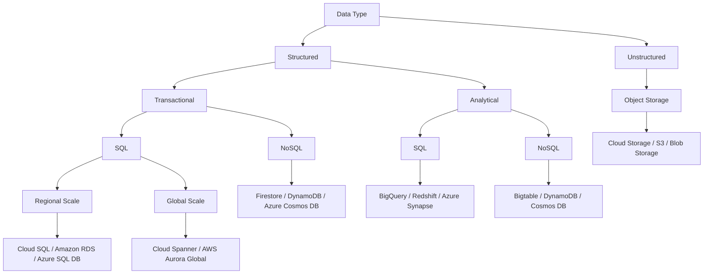

# AI and Machine Learning in the Cloud: A Beginner's Guide

Artificial Intelligence (AI) and Machine Learning (ML) are changing the world, making it easier for computers to do things that only humans could do before. With new AI tools that can create content based on simple instructions, there are now more ways than ever to use this technology in everyday work and life.

For example, if you’re a developer, you might want to add AI features to your app to make it more useful. If you work with data, you could build an ML model to help solve problems at your job. Even if you’re just curious about AI, learning about it can spark fresh ideas for new projects or businesses.

This hand book is here to help you understand how AI works and show you how to start using it. You’ll learn about basic tools that can help you get from raw data to useful AI solutions. We’ll also explore how you can use generative AI tools to develop your own projects.

### What is this book about?

This book is a practical toolbox, filled with essential AI technologies and tools that you can use to build new projects or enhance your existing ones. We’ve organized these tools in layers, so you’ll start with the basics, like data storage and analytics, and work up to advanced topics like building custom ML models. Along the way, you’ll explore generative AI solutions that can generate content, solve problems.

### Objectives

By the end of this book, you will be able to:

- **Understand** the basics of AI and how it can be applied to real-world projects.
- **Recognize** the essential tools needed to turn data into AI-driven solutions.
- **Identify** different options for incorporating AI into various types of projects.
- **Start experimenting** with AI, giving you the confidence to innovate and explore new possibilities.

## Why AI and How It Can Help Businesses?

These might be your first questions. Let's explore an example to understand how AI can make business operations more efficient.

**City Wheels**, a local company that provides bike rentals in cities like Amsterdam, Chicago, and Sydney, is a good example.

City Wheels faced three main challenges:

1. **Choosing Locations and Optimizing Routes**: Predicting the best spots for bike rental stations and optimizing bike routes based on weather and traffic.
2. **Demand Prediction and Real-Time Tracking**: Predicting rental demand and tracking performance in real-time to ensure enough bikes are available.
3. **Automating Customer Alerts**: Automating notifications to customers about station availability or weather conditions to help them plan their ride.

Recognizing the potential of AI, City Wheels sought help from **Bright Analytics**, a data consultancy, to use data and AI to solve these challenges.

### A Simple Dashboard for City Wheels

The team created a simple dashboard to show the performance across the cities they operate in, providing insights into metrics like **revenue**, **bike availability**, and **rental duration**. They used common tools like **spreadsheets** for data logging and scripts for analyzing data.

For example, the dashboard shows statistics about Amsterdam, such as rental frequency, average revenue per bike, and station performance. In the top left corner, you can see the **weather conditions**, which helps the system suggest route changes based on forecasts. For example, if rain is expected, it might suggest safer, covered routes.

### AI-Powered Predictions and Alerts

City Wheels used prediction tools to forecast peak rental times. If a major city event like a festival was happening, the system would automatically adjust bike availability to meet increased demand.

The AI also helps with **customer alerts**. For example, if a station is running low on bikes, a script automatically sends messages to customers about nearby available locations. This feature makes sure customers always have up-to-date information, improving their experience.

### Streamlined Business with AI

Adding these basic AI features helped City Wheels achieve the following benefits:

- **Better Operations**: Improved the efficiency of bike distribution across stations and ensured enough bikes were available using real-time data.
- **Improved Customer Experience**: Automated notifications and route suggestions helped customers have a more informed and convenient rental experience.
- **Easier Scaling**: With automated dashboards and scripts, City Wheels could expand operations without adding much administrative work.

Behind the scenes, the approach was simple:

1. **Data Collection**: Collecting data on bike rentals, station performance, and customer preferences using simple spreadsheets.
2. **Prediction and Automation**: Using scripts for demand prediction and customer alerts.
3. **Visualization**: Showing the insights through an easy-to-use dashboard.

By using these tools, City Wheels made their operations more efficient, improved customer service, and increased productivity—showing how even basic AI and data-driven methods can lead to big improvements in business performance.

## What is Responsible AI?

Responsible AI refers to the development, deployment, and use of artificial intelligence systems in ways that prioritize ethical considerations, fairness, transparency, accountability, and the well-being of all stakeholders. The goal is to ensure that AI technologies align with societal values and do not perpetuate harm or bias. Key principles in responsible AI include:

1. **Fairness:** Ensuring that AI systems do not discriminate against individuals or groups, intentionally or unintentionally. This involves addressing biases in data and algorithms.

2. **Transparency:** Making AI systems understandable and explainable to users, so people can see how decisions are made and feel confident in the technology.

3. **Accountability:** Ensuring that creators and users of AI systems take responsibility for their impact and have mechanisms in place for recourse if something goes wrong.

4. **Privacy:** Protecting user data by implementing strong security measures and respecting data privacy laws and regulations.

5. **Safety:** Prioritizing the safety and security of AI systems to prevent harm, including developing safeguards against misuse or malicious actions.

6. **Inclusivity:** Involving diverse perspectives in the design and development process to minimize blind spots and create systems that work well for everyone.

7. **Sustainability:** Considering the environmental impact of AI systems and finding ways to reduce their energy consumption and carbon footprint.

## Cloud Infrastructure

When exploring the infrastructure and services offered by various cloud providers, such as Amazon Web Services (AWS), Microsoft Azure, and Google Cloud Platform (GCP), it's essential to understand the core components: processing power, storage options, and how to determine the best fit for different data types. Following highlights key features across these providers to help you make informed decisions.

### Processing Power

Cloud computing platforms provide various types of processing power to meet diverse computational needs, especially for data-intensive and machine learning tasks. Let's compare the options available:

- **CPU (Central Processing Unit):** CPUs are general-purpose processors suitable for a wide range of applications. All major cloud providers offer CPU options that can be configured based on needs. For instance, AWS provides EC2 instances with Intel or AMD CPUs, and Azure offers similar virtual machines. Google’s Compute Engine also offers customizable CPU instances, allowing users to select specific virtual CPU and memory configurations.

- **GPU (Graphics Processing Unit):** GPUs are optimized for parallel processing tasks, making them ideal for high-performance computing (HPC) and machine learning workloads. AWS offers GPU-based instances through its EC2 P-series and G-series, supporting frameworks like TensorFlow and PyTorch. Azure has its own GPU VMs under the NC-series and NV-series, while Google Cloud offers GPU instances with options for both NVIDIA Tesla and AMD cards.

- **TPU (Tensor Processing Unit):** Designed specifically for machine learning, TPUs are unique to Google Cloud. They provide accelerated computing power for AI tasks, especially for frameworks like TensorFlow. Google developed TPUs to handle matrix multiplication and other computations common in neural network training. AWS and Azure do not offer TPUs but have enhanced GPU support for similar AI workloads. For companies heavily investing in AI, Google’s TPU offerings might provide a competitive edge in processing speed and efficiency.

### Storage Options

Cloud storage solutions fall into different categories based on the type of data and access needs. Object storage, SQL databases, and NoSQL databases each serve different purposes:

#### Object Storage

Object storage is suitable for unstructured data like images, videos, and backups.

- **AWS S3 (Simple Storage Service):** Provides scalable object storage with multiple storage classes like Standard, Intelligent-Tiering, Infrequent Access, and Glacier for long-term archiving.
- **Google Cloud Storage:** Google offers four storage classes—Standard, Nearline, Coldline, and Archive—catering to different access needs and cost considerations.

- **Azure Blob Storage:** Azure's object storage solution includes tiers like Hot, Cool, and Archive, which mirror the options provided by AWS and GCP for access frequency and cost optimization.

#### SQL Databases

For structured, transactional data that requires SQL access, cloud providers offer managed relational database services.

- **Amazon RDS (Relational Database Service):** RDS supports MySQL, PostgreSQL, Oracle, and Microsoft SQL Server. It’s ideal for applications requiring regional scalability and consistent access.

- **Google Cloud SQL:** Google’s managed SQL database service supports MySQL, PostgreSQL, and SQL Server, ideal for regional data storage needs.

- **Azure SQL Database:** Azure’s fully managed relational database service supports SQL Server and is highly integrated with Azure services, providing options for scaling globally or regionally.

#### NoSQL Databases

For structured data that doesn’t fit neatly into a relational model, NoSQL databases are available:

- **AWS DynamoDB:** A fully managed NoSQL database that offers fast, consistent performance for applications requiring high read and write throughput. DynamoDB is suited for transactional workloads with global scalability.

- **Google Firestore:** A NoSQL, document-oriented database supporting real-time data synchronization, ideal for mobile and web applications requiring transactional support.

- **Azure Cosmos DB:** A globally distributed NoSQL database supporting multiple models, including key-value, graph, and document data. Cosmos DB offers low-latency and high scalability across multiple Azure regions.

### Analytical Storage Options

For analytical workloads, cloud providers offer data warehouses and big data solutions.

- **AWS Redshift:** A data warehouse solution designed for big data and analytical tasks. Redshift supports large-scale queries with fast performance.

- **Google BigQuery:** Google’s fully managed data warehouse optimized for analytics. BigQuery is particularly suited for massive data processing needs with SQL-based querying capabilities.

- **Azure Synapse Analytics:** An analytics service that brings together big data and data warehousing. Synapse Analytics enables high-performance SQL and Apache Spark data processing.

### Choosing the Right Storage Solution

When selecting a storage solution, consider the data type and business requirements.

- **For transactional, SQL-based data** that requires frequent updates and local scalability, **Cloud SQL (Google)**, **Amazon RDS (AWS)**, or **Azure SQL Database** are ideal choices. For global scalability, **Google Cloud Spanner** or **AWS Aurora Global Database** offer more comprehensive solutions.

- **For transactional, NoSQL data**, **Firestore (Google)** or **DynamoDB (AWS)** provides scalability for web and mobile applications.

- **For analytical workloads** requiring SQL, **BigQuery (Google)**, **Redshift (AWS)**, or **Azure Synapse Analytics** are designed to handle complex queries on large datasets.

- **For unstructured data** such as media files or backups, **Google Cloud Storage**, **AWS S3**, and **Azure Blob Storage** provide scalable, secure storage with varying classes or tiers suited to different access patterns.



## Data and AI Solutions

The journey from data to AI can generally be divided into four categories: **ingestion and processing**, **data storage**, **analytics**, and **AI/machine learning**.

**1. Data Ingestion and Processing**

Data ingestion and processing involve gathering data from multiple sources and transforming it into a format suitable for storage and analysis. This stage includes both real-time and batch data processing.

Cloud platforms provide various tools to collect and process data in both real-time and batch formats. For example:

- **Google Cloud**: Offers services like **Pub/Sub** for real-time messaging, **Dataflow** for stream and batch processing, **Dataproc** for running Apache Spark and Hadoop, and **Cloud Data Fusion** for data integration.
- **AWS**: Features services like **Kinesis** for real-time data ingestion, **Glue** for ETL (extract, transform, load) tasks, and **EMR** for running big data frameworks like Hadoop and Spark.
- **Microsoft Azure**: Has **Azure Event Hubs** for real-time data streaming, **Azure Data Factory** for ETL and integration services, and **HDInsight** for managed Hadoop and Spark clusters.

**2. Data Storage**

Data storage is the process of saving the collected data in suitable storage solutions. Depending on the type of data (structured, unstructured, or semi-structured) and business needs, different storage options are used to ensure scalability, reliability, and ease of access.

Once data is collected, it needs to be stored in appropriate databases or storage services. Different types of data require different storage solutions:

- **Google Cloud**: Offers **Cloud Storage** for unstructured data, **BigQuery** for data warehousing, **Cloud SQL** and **Spanner** for relational data, and **Firestore** and **Bigtable** for NoSQL databases.
- **AWS**: Provides **S3** for object storage, **RDS** and **Aurora** for SQL databases, **Redshift** for data warehousing, and **DynamoDB** for NoSQL needs.
- **Microsoft Azure**: Offers **Azure Blob Storage** for unstructured data, **Azure SQL Database** and **Cosmos DB** for SQL and NoSQL data, and **Azure Synapse** for big data analytics.

**3. Data Analytics**

Data analytics involves analyzing the stored data to derive meaningful insights. This stage includes using tools to query, visualize, and model the data, ultimately enabling businesses to make informed decisions based on the insights gained.

After storing the data, analytics tools come into play to derive meaningful insights:

- **Google Cloud**: **BigQuery** is a popular fully managed data warehouse that enables SQL-based analytics and integration with AI features. **Looker** provides powerful BI tools for data visualization and modeling.
- **AWS**: **Redshift** is a powerful data warehouse solution that integrates seamlessly with AWS services. **QuickSight** is AWS's BI tool for visualizing and analyzing data.
- **Microsoft Azure**: **Azure Synapse Analytics** combines big data and data warehousing to offer SQL-based analytics, and **Power BI** provides a user-friendly way to visualize and report on the data.

**4. AI and Machine Learning**

AI and machine learning involve using the analyzed data to build predictive models or generate new content. This stage includes training, deploying, and managing AI models that can help predict future trends or solve complex problems.

The final stage is using data to build AI models that can generate predictions or create content:

- **Google Cloud**: **Vertex AI** provides an integrated environment for building and deploying machine learning models, with tools like AutoML, Workbench, and Model Garden.
- **AWS**: **SageMaker** is AWS's machine learning platform that offers end-to-end services, from data labeling to model deployment and monitoring.
- **Microsoft Azure**: **Azure Machine Learning** provides tools for model training, deployment, and management, along with features for automated machine learning (AutoML).

## Understanding AI and ML

The terms "artificial intelligence" and "machine learning" are often used interchangeably, but they are not the same. AI is a broad concept that encompasses any technology that enables machines to mimic human intelligence—whether it is in problem-solving, recognizing speech, or making decisions. Imagine a robot that can navigate a maze without any explicit programming or a virtual assistant capable of holding a conversation. These are examples of AI.

Machine learning, on the other hand, is a subset of AI focused on providing machines the ability to learn from data without needing explicit instructions. In contrast to traditional programming—where every step of what the computer should do is hard-coded—ML enables machines to learn patterns from examples. Think of teaching a computer to identify different tree species by showing it many images of various trees. This is machine learning at work.

ML itself can be divided into various categories, most notably supervised learning, unsupervised learning, and deep learning. Each type comes with distinct techniques and use cases.

## Categories of Machine Learning

### Supervised Learning

Supervised learning involves training a model using data that has labels. A label is simply the answer we want the model to learn—much like having a teacher explain each problem to a student with the correct answer. Consider a scenario where you want to teach a machine to recognize the difference between different genres of music. You could provide the computer with thousands of music clips, each labeled with its genre—such as "jazz," "rock," or "classical." By learning from these labeled examples, the machine learns how to identify new music clips that it hasn’t encountered before. This process is called supervised learning because the model is being "supervised" by being provided the correct answers during training.

Supervised learning can be further divided into two categories:

1. **Classification**: When the goal is to predict a category or class, such as determining whether an email is "spam" or "not spam," or predicting the type of flower based on petal length and width, it is called a classification problem.
   - **Model Example**: **Logistic Regression** is a popular model used for classification tasks., such as determining whether an email is "spam" or "not spam," or predicting the type of flower based on petal length and width, it is called a classification problem.
2. **Regression**: When the task involves predicting a continuous value, such as estimating the price of a house based on its features (size, location, number of bedrooms, etc.), it is called a regression problem.
   - **Model Example**: **Linear Regression** is a commonly used model for regression tasks., such as estimating the price of a house based on its features (size, location, number of bedrooms, etc.), it is called a regression problem.

### Unsupervised Learning

Unsupervised learning is different from supervised learning because the data provided to the model is unlabeled. There are no "correct answers" to guide the learning process. Instead, the machine finds hidden patterns or relationships on its own. Imagine that you run an art gallery and you have paintings of different styles, but you don’t know which categories they belong to. By applying unsupervised learning, you could group similar paintings together based on their visual characteristics—such as color schemes, brushstrokes, or subject matter—without explicitly telling the model what to look for. This is clustering, a common form of unsupervised learning.

Unsupervised learning can be grouped into the following categories:

1. **Clustering**: This method is used to identify similarities among data points and group them accordingly. For instance, online retailers may use clustering to understand customer segments and offer personalized promotions.
   - **Model Example**: **K-means** is a popular model for clustering tasks. and group them accordingly. For instance, online retailers may use clustering to understand customer segments and offer personalized promotions.
2. **Association**: This technique is used to find relationships between variables in a dataset. For example, a grocery store might use association to determine which products are often purchased together—such as bread and butter—to create more effective marketing campaigns.
   - **Model Example**: The **Apriori Algorithm** is frequently used for association tasks. in a dataset. For example, a grocery store might use association to determine which products are often purchased together—such as bread and butter—to create more effective marketing campaigns.
3. **Dimensionality Reduction**: Sometimes data can have an overwhelming number of features, making it difficult to analyze efficiently. Dimensionality reduction is used to reduce the number of features while retaining the important information. For example, a health survey with many questions might be simplified to just a few key factors representing a person’s lifestyle.
   - **Model Example**: **Principal Component Analysis (PCA)** is commonly used for dimensionality reduction., making it difficult to analyze efficiently. Dimensionality reduction is used to reduce the number of features while retaining the important information. For example, a health survey with many questions might be simplified to just a few key factors representing a person’s lifestyle.

## Deep Learning and Generative AI

Deep learning is a specialized subset of machine learning that uses multi-layered artificial neural networks to perform complex tasks. Imagine trying to teach a computer to recognize faces. This requires identifying features at multiple levels—such as detecting edges, shapes, and then combining them into recognizable facial features. Deep neural networks accomplish this by adding many layers between the input data (such as an image) and the output (such as identifying the face). These layers progressively refine the learning, allowing the machine to understand complex features.

Generative AI is a special form of deep learning that allows models to generate new content, such as text, images, or music. Suppose you want a computer to write poetry. You could use a generative AI model, trained on thousands of poems, to produce original verses.

- **Model Example**: **GPT (Generative Pre-trained Transformer)** is a well-known model for generative AI.

Generative AI relies on very large models called large language models (LLM), which have learned from massive datasets to produce coherent and contextually appropriate outputs. that allows models to generate new content, such as text, images, or music. Suppose you want a computer to write poetry. You could use a generative AI model, trained on thousands of poems, to produce original verses. Generative AI relies on very large models called large language models, which have learned from massive datasets to produce coherent and contextually appropriate outputs.

## Comparing Supervised and Unsupervised Learning

To clarify the distinction between supervised and unsupervised learning, consider the following examples:

- **Supervised Learning**: You have a set of animal sounds, each labeled as "dog," "cat," or "bird." You use these labeled sounds to train a model that can predict the animal from an unknown sound. Here, the model is guided by the labels provided, and the objective is to make accurate predictions.
- **Unsupervised Learning**: Imagine you are given recordings of various animal sounds, but there are no labels indicating which animal made which sound. An unsupervised learning model could identify which sounds are similar and group them accordingly, allowing you to understand which sounds might belong to the same or related species.

## Test Your Knowledge

1. You are working at a bank and want to predict whether a customer will default on their loan based on their financial history and credit score.

   - What category of learning is this?
     <details>
       <summary>Answer</summary>
       Supervised Learning
     </details>
   - What type of model should you use?
     <details>
       <summary>Answer</summary>
       Classification, such as **Logistic Regression**
     </details>

2. Imagine you own a retail store and want to group customers based on their purchasing behavior to understand different customer segments.

   - What category of learning is this?
     <details>
       <summary>Answer</summary>
       Unsupervised Learning
     </details>
   - What type of model should you use?
     <details>
       <summary>Answer</summary>
       Clustering, such as **K-means**
     </details>

3. You are an engineer at an energy company and need to forecast energy consumption for the upcoming month based on historical data.

   - What category of learning is this?
     <details>
       <summary>Answer</summary>
       Supervised Learning
     </details>
   - What type of model should you use?
     <details>
       <summary>Answer</summary>
       Regression, such as **Linear Regression**
     </details>

4. You work for a supermarket and want to discover which products are frequently bought together to optimize product placement.

   - What category of learning is this?
     <details>
       <summary>Answer</summary>
       Unsupervised Learning
     </details>
   - What type of model should you use?
     <details>
       <summary>Answer</summary>
       Association, such as **Apriori Algorithm**
     </details>

5. You have a dataset of images, and you want to reduce the number of features to make it easier to process while retaining the most important information.
   - What category of learning is this?
     <details>
       <summary>Answer</summary>
       Unsupervised Learning
     </details>
   - What type of model should you use?
     <details>
       <summary>Answer</summary>
       Dimensionality Reduction, such as **Principal Component Analysis (PCA)**
     </details>

## Training a Logistic Regression Model on Google Merchandise Shop Data using BigQuery ML

In this section, we build and evaluate a logistic regression model using Google Merchandise Shop data. We'll explore how to prepare the data, train the model, evaluate its performance, and make predictions. Along the way, we'll delve into key concepts and terms that are essential for understanding machine learning models in a BigQuery ML environment.

### 1. Introduction to the Dataset

The Google Merchandise Shop dataset is a publicly available dataset that contains Google Analytics sample data. It includes information about user interactions with the online store, such as page views, transactions, device information, and geographic data.

Our goal is to predict whether a user session will lead to a transaction (purchase) based on features like operating system, device type, country, and page views.

### 2. Data Preparation

Before training the model, we need to prepare the data by selecting relevant features and formatting it appropriately.

#### 2.1 Extracting Relevant Features

We use the following SQL query to extract the necessary features from the dataset:

```sql
SELECT
  IF(totals.transactions IS NULL, 0, 1) AS label,
  IFNULL(device.operatingSystem, "") AS os,
  device.isMobile AS is_mobile,
  IFNULL(geoNetwork.country, "") AS country,
  IFNULL(totals.pageviews, 0) AS pageviews
FROM
  `bigquery-public-data.google_analytics_sample.ga_sessions_*`
WHERE
  _TABLE_SUFFIX BETWEEN '20160801' AND '20170631'
LIMIT 10000;
```

**Explanation of the Query:**

- **IF(totals.transactions IS NULL, 0, 1) AS label**: Creates a binary label where sessions with transactions are marked as `1` (positive class) and those without are `0` (negative class).
- **IFNULL(device.operatingSystem, "") AS os**: Retrieves the operating system used during the session, replacing `NULL` values with an empty string.
- **device.isMobile AS is_mobile**: A boolean indicating if the device used is mobile.
- **IFNULL(geoNetwork.country, "") AS country**: Retrieves the country from which the session originated, replacing `NULL` values with an empty string.
- **IFNULL(totals.pageviews, 0) AS pageviews**: Number of pages viewed during the session, with `NULL` values replaced by `0`.

We save the result of this query as `training_data`.


### 3. Training the Logistic Regression Model

With our data prepared, we proceed to train a logistic regression model using BigQuery ML.

#### 3.1 Creating the Model

We use the following SQL command to create and train the model:

```sql
CREATE OR REPLACE MODEL `bqml.sample_model`
OPTIONS(model_type='logistic_reg') AS
SELECT * FROM `bqml.training_data`;
```

**Explanation of the Command:**

- **CREATE OR REPLACE MODEL `bqml.sample_model`**: Creates a new model or replaces an existing one named `sample_model` in the `bqml` dataset.
- **OPTIONS(model_type='logistic_reg')**: Specifies that the model type is logistic regression.
- **AS SELECT \* FROM `bqml.training_data`**: Uses all columns from `training_data` as input features for training.

#### 3.2 Understanding the Training Output

After running the command, BigQuery ML provides a training output that includes several key metrics:


**Key Terms Explained:**

- **Iteration**: Represents each pass through the training data during the optimization process.
- **Training Data Loss**: Measures how well the model fits the training data; lower values indicate a better fit.
- **Evaluation Data Loss**: Measures the model's performance on a separate evaluation dataset.
- **Learn Rate**: The step size used in the optimization algorithm to update the model parameters.
- **Duration (seconds)**: Time taken for each iteration.

### 4. Evaluating the Model

Evaluation is crucial to understand how well our model generalizes to unseen data.

#### 4.1 Evaluating Model Performance

We use the following SQL command to evaluate the model:

```sql
SELECT
  *
FROM
  ML.EVALUATE(MODEL `bqml.sample_model`);
```

This command outputs various evaluation metrics.


**Explanation of Evaluation Metrics:**

- **Threshold**: The probability cutoff used to classify a session as positive (transaction) or negative (no transaction).
- **Precision**: The ratio of true positive predictions to the total predicted positives. It answers the question: "Of all sessions predicted to result in a transaction, how many actually did?"
- **Recall**: The ratio of true positive predictions to all actual positives. It answers: "Of all sessions that actually resulted in a transaction, how many did we predict correctly?"
- **Accuracy**: The ratio of correct predictions (both true positives and true negatives) to the total number of predictions.
- **F1 Score**: The harmonic mean of precision and recall, providing a balance between the two.
- **Log Loss**: Measures the model's uncertainty in its predictions; lower values indicate better performance.
- **ROC AUC (Receiver Operating Characteristic Area Under Curve)**: Represents the model's ability to distinguish between classes; a higher value indicates better performance.
- **Positive Class Threshold**: The probability threshold at which the positive class is predicted.

#### 4.2 Confusion Matrix

A confusion matrix provides a detailed breakdown of the model's predictions.


**Confusion Matrix Terms:**

- **True Positives (TP)**: Correctly predicted positive observations.
- **False Positives (FP)**: Incorrectly predicted positive observations.
- **True Negatives (TN)**: Correctly predicted negative observations.
- **False Negatives (FN)**: Incorrectly predicted negative observations.

```math
\text{Precision} = \frac{TP}{TP + FP}
```

```math
\text{Recall} = \frac{TP}{TP + FN}
```

```math
\text{Accuracy} = \frac{TP + TN}{TP + TN + FP + FN}
```

```math
\text{F1 Score} = 2 \times \frac{\text{Precision} \times \text{Recall}}{\text{Precision} + \text{Recall}}
```

#### 4.3 Precision-Recall and ROC Curves

- **Precision-Recall Curve**: Plots precision vs. recall for different thresholds, helping to visualize the trade-off between the two.
- **ROC Curve**: Plots the true positive rate against the false positive rate at various threshold settings.

These curves assist in selecting the optimal threshold for classifying sessions.

### 5. Making Predictions

With the model trained and evaluated, we can use it to make predictions on new data.

#### 5.1 Preparing the July Data

We extract data from July using the following query:

```sql
SELECT
  IF(totals.transactions IS NULL, 0, 1) AS label,
  IFNULL(device.operatingSystem, "") AS os,
  device.isMobile AS is_mobile,
  IFNULL(geoNetwork.country, "") AS country,
  IFNULL(totals.pageviews, 0) AS pageviews,
  fullVisitorId
FROM
  `bigquery-public-data.google_analytics_sample.ga_sessions_*`
WHERE
  _TABLE_SUFFIX BETWEEN '20170701' AND '20170801';
```

We save this data as `july_data`.

#### 5.2 Predicting Total Purchases by Country

We use the following query to predict total purchases by country:

```sql
SELECT
  country,
  SUM(predicted_label) AS total_predicted_purchases
FROM
  ML.PREDICT(MODEL `bqml.sample_model`, (
    SELECT * FROM `bqml.july_data`))
GROUP BY country
ORDER BY total_predicted_purchases DESC
LIMIT 10;
```

**Explanation of the Query:**

- **ML.PREDICT**: Applies the trained model to the new data.
- **SUM(predicted_label)**: Sums up the predicted labels to estimate total purchases per country.
- **GROUP BY country**: Groups the results by country.
- **ORDER BY total_predicted_purchases DESC**: Orders the results in descending order of predicted purchases.
- **LIMIT 10**: Returns the top 10 countries with the highest predicted purchases.

#### 5.3 Predicting Purchases by Visitor ID

Similarly, we predict total purchases by visitor ID:

```sql
SELECT
  fullVisitorId,
  SUM(predicted_label) AS total_predicted_purchases
FROM
  ML.PREDICT(MODEL `bqml.sample_model`, (
    SELECT * FROM `bqml.july_data`))
GROUP BY fullVisitorId
ORDER BY total_predicted_purchases DESC
LIMIT 10;
```

This helps identify the top visitors likely to make purchases.

## AI Development Solutions

When it comes to developing machine learning (ML) solutions in the cloud, you have multiple options, leading providers offer a range of services catering to different levels of expertise and use cases. Let’s explore how each of these platforms provides similar functionalities for building ML models.

### Pre-Trained APIs

Pre-trained APIs are ideal when you lack enough data or expertise to develop your own ML models. All major cloud providers offer these services:

- **Google Cloud** offers Vision AI, Natural Language AI, and Speech-to-Text APIs, which are pre-trained and allow you to easily integrate ML capabilities for tasks like image recognition, natural language processing, and speech analysis.
- **AWS** offers services like Amazon Rekognition for image and video analysis, Amazon Polly for text-to-speech, and Amazon Comprehend for natural language processing. These are ready-made tools that allow you to integrate ML features without any model training.
- **Microsoft Azure** provides Cognitive Services, which include pre-trained APIs for vision, speech, and language, allowing developers to integrate ML capabilities with minimal effort.

These APIs are a great fit when you need fast deployment for typical AI use cases like image classification, speech recognition, and sentiment analysis.

### Low-Code Solutions

If you have some experience with data but want to avoid the complexities of custom coding, low-code options such as SQL-based ML solutions can be beneficial. Here’s how the different providers compare:

- **Google Cloud** offers BigQuery ML, which allows you to create ML models using SQL queries, making it easy for those familiar with databases to leverage ML without extensive coding.
- **AWS** provides Amazon Redshift ML, allowing users to leverage SQL to create, train, and deploy ML models. If your data is already stored in Redshift, this can be a seamless way to develop predictive models.
- **Microsoft Azure** has Azure Machine Learning with integration to SQL databases, where users can use Azure ML Studio’s designer to create models with drag-and-drop functionalities, simplifying the process for analysts and data engineers.

These services work well when you have data in **tabular formats** and prefer leveraging familiar querying languages to build predictive models.

### No-Code Solutions

No-code solutions are ideal if you want to build custom ML models without writing code. They allow users to focus on solving business problems rather than dealing with ML algorithms and parameters.

- **Google Cloud** provides AutoML on Vertex AI, offering a no-code interface to train custom models with ease.
- **AWS** has Amazon SageMaker Autopilot, which enables users to create, train, and tune ML models through an intuitive interface. It’s useful for those looking for a balance between customization and simplicity.
- **Microsoft Azure** offers Azure Automated ML, which automatically selects the best model and hyperparameters for your data. The drag-and-drop experience allows users to quickly develop custom models without extensive coding skills.

These platforms are perfect if you want to build models using your own data but want a streamlined, user-friendly experience.

### Custom ML Models with Full Control

If you need complete flexibility to design and train ML models according to your requirements, custom ML training solutions are available from all major providers.

- **Google Cloud** offers Vertex AI Workbench and integrations with Google Colab, allowing ML engineers and data scientists to code their own models, tune hyperparameters, and have complete control over the pipeline.
- **AWS** provides Amazon SageMaker, which supports custom ML workflows with extensive control over data preprocessing, training, tuning, and deployment. SageMaker also provides tools for advanced users to implement a fully customized pipeline.
- **Microsoft Azure** has Azure Machine Learning with support for custom code-based models, enabling developers to work in familiar environments like Jupyter notebooks to train, tune, and operationalize their models.

These options are best suited for data scientists and ML engineers who need precise control over their models, from training to deployment.

### Comparison Summary

| Feature                                 | Pre-trained APIs                   | BigQuery ML     | AutoML                      | Custom training             |
| --------------------------------------- | ---------------------------------- | --------------- | --------------------------- | --------------------------- |
| **Data type**                           | Tabular, image, text, audio, video | Tabular         | Tabular, image, text, video | Tabular, image, text, video |
| **Training data size**                  | No data required                   | Medium to large | Small to medium             | Medium to large             |
| **ML and coding expertise**             | Low                                | Medium          | Low                         | High                        |
| **Flexibility to tune hyperparameters** | None                               | Medium          | None                        | High                        |
| **Time to train a model**               | None                               | -               | -                           | Long                        |

## Pre-Trained APIs

Pre-trained APIs, offered by many cloud platforms, are a great way to quickly leverage AI capabilities for specific tasks. These APIs allow developers to add functionalities like image recognition, sentiment analysis, and speech processing without having to train custom models. Let’s look at how different cloud platforms offer these services.

**Google Cloud** provides a range of pre-trained APIs, such as the Vision API for image recognition, Natural Language API for analyzing text, and the Speech-to-Text API for transcribing spoken language. The **Natural Language API** offers four types of analysis: **entity analysis**, **sentiment analysis**, **syntax analysis**, and **category analysis**.

- **Entity analysis** identifies subjects in the text, such as proper nouns (e.g., names of people, places, organizations) and common nouns. It provides detailed information about each entity, including entity type, salience (how important the entity is within the context of the document), and metadata such as Wikipedia links or identifiers. This is particularly useful for automating content tagging, extracting key information from large documents, or building knowledge graphs.

- **Sentiment analysis** measures the emotions in text, ranging from negative to positive, and includes a magnitude score to indicate the overall strength of emotion. Sentiment scores range from -1.0 to 1.0, where -1.0 indicates strong negative sentiment and 1.0 indicates strong positive sentiment. The magnitude score reflects the overall emotional content of the text, regardless of whether it is positive or negative, which is helpful in determining the intensity of emotions expressed. This can be applied to customer reviews, social media content, and other textual data to assess public perception and customer satisfaction.

- **Syntax analysis** extracts linguistic information for further language model training. It identifies parts of speech (e.g., nouns, verbs, adjectives), tokenizes sentences, and provides grammatical relationships between words (e.g., subject-verb relationships). Syntax analysis helps in understanding the structure and grammar of a sentence, which can be used to improve machine translation, enhance search algorithms, or support language-based applications where precise linguistic context is needed.

- **Category analysis** classifies the entire text into predefined categories, providing insights into the general topic of the content. This uses a taxonomy of categories, such as Arts & Entertainment, Finance, Health, and more, allowing developers to quickly determine the subject matter of a document. This feature is useful for content filtering, targeted advertising, and organizing documents by topic.

Google also offers **Dialogflow** for building conversational interfaces, enabling developers to create chatbots and virtual assistants that can understand and respond to user input in a natural, conversational manner.

Google Cloud also offers generative AI capabilities through models like **Gemini** and **Imagen**, which handle text, image, and multimodal data processing. **Gemini** provides natural language understanding and conversation capabilities, supporting tasks such as text generation, summarization, and dialogue management. **Imagen** generates images and captions from textual descriptions, which can be used for content creation, marketing, or design. Additional generative APIs include **Chirp** for speech, allowing voice-enabled applications, and **Codey** for generating, completing, and chatting about code, which can significantly streamline the software development process.

**Amazon Web Services (AWS)** also offers a suite of AI services that help developers integrate intelligent capabilities into applications. For instance, **Amazon Rekognition** provides image and video analysis, detecting objects, scenes, and even inappropriate content. **Amazon Comprehend** is a natural language processing (NLP) service that can perform sentiment analysis, entity recognition, and topic modeling, similar to Google’s Natural Language API. In the conversational AI space, **Amazon Lex** provides tools to build chatbots, similar to Google’s Dialogflow.

**Microsoft Azure** offers pre-trained AI models under its **Azure Cognitive Services**. Azure's **Computer Vision** and **Custom Vision** APIs help identify objects, extract text, and more, while the **Text Analytics API** allows sentiment analysis, key phrase extraction, and language detection. For speech, **Azure Speech Services** convert spoken language into text and even add synthesis for text-to-speech functionalities. Azure also provides **Azure OpenAI Service**, integrating models like GPT for natural language understanding and content generation. For building chatbots, Azure’s **Bot Framework** can be a direct competitor to Dialogflow.

These pre-trained APIs provide powerful building blocks for integrating AI into your applications without the expense or complexity of building custom models. For example, imagine wanting to create a customer feedback analysis tool. Using Google Cloud’s Natural Language API or AWS's Amazon Comprehend, you can automatically analyze sentiment in customer reviews. Alternatively, using Azure’s Speech Services or Google Cloud's Speech-to-Text API, you could transcribe customer calls to further analyze customer satisfaction.

Generative AI is another fast-growing area. Each major cloud provider has its offerings here: Google Cloud has **Gemini** for natural language and **Imagen** for images; AWS provides **Bedrock**, which allows access to foundational models like Claude and Stable Diffusion; Azure has the **Azure OpenAI Service**, enabling integration with models like GPT-4 and DALL-E. These generative APIs can be used to build applications that produce content, such as generating marketing copy, creating images for social media, or synthesizing voices for automated systems.

## AutoML by Google in Vertex AI

AutoML, is a powerful tool that streamlines the entire process of building and deploying machine learning (ML) models. Traditionally, creating an ML model requires continuous iteration—adding new data and features, experimenting with different models, and tuning parameters—to achieve the best results. AutoML alleviates this manual workload by automating the ML pipeline from data preprocessing to model training and deployment.

AutoML operates in four distinct phases:

#### Phase 1: Data Processing

AutoML simplifies data preparation by automating data formatting after you upload your dataset. It can convert numbers, dates, text, categories, arrays or nested fields into formats suitable for ML, ensuring your data is ready for modeling.

#### Phase 2: Model Search and Parameter Tuning

In this phase, AutoML finds the optimal model and tunes its parameters using two key technologies:

1. **Neural Architecture Search**: This technology helps AutoML automatically explore a range of model architectures and configurations to identify the most effective one for your data. It does this by using reinforcement learning and evolutionary algorithms to iteratively test and refine different architectures, selecting the best-performing models based on metrics such as accuracy and computational efficiency.

2. **Transfer Learning**: Transfer learning allows AutoML to use pre-trained models as a starting point, enabling great results even with smaller datasets. For example, large language models (LLMs) are pre-trained on vast datasets and can be fine-tuned to solve specific problems in different fields like retail or finance. This approach saves time and computational resources, achieving higher accuracy with less data.

#### Phase 3: Model Assembly

Once the best models are identified, they are assembled to enhance prediction accuracy. Rather than relying on a single model, AutoML uses an ensemble of top-performing models, typically averaging their predictions. This strategy ensures greater robustness and accuracy in the final output.

#### Phase 4: Prediction

In the final phase, the assembled models are prepared for prediction. By leveraging multiple models rather than a single one, AutoML improves prediction accuracy and delivers better results.
